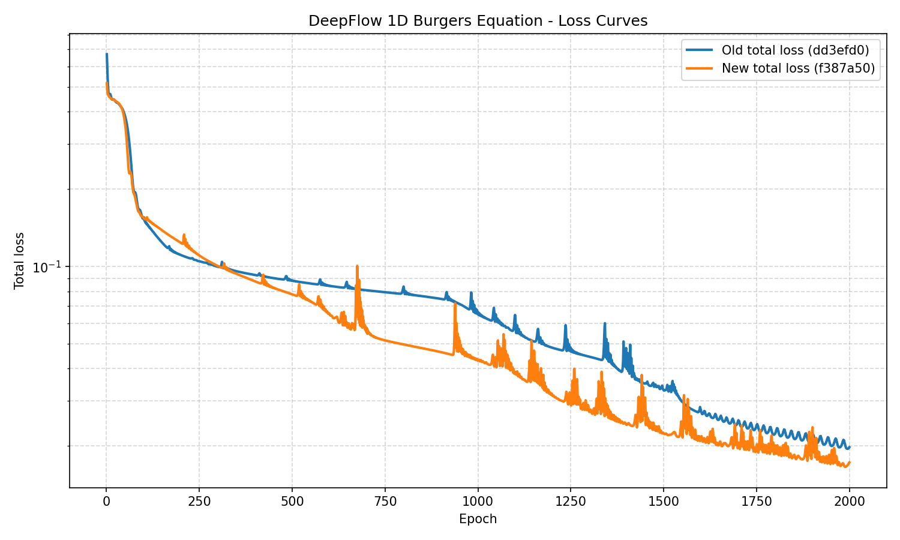

# DeepFlow 1D Burgers Equation Benchmark Report

## Setup

- **PDE**: 1D Burgers equation,  $u_t + u u_x = \nu u_{xx}$  with  $\nu = \frac{0.01}{\pi}$
- **Coordinates**: `x` is the spatial coordinate; `y` is time ($t$ in the PDE notation).
- **Domain**:  $x \in [-1.0, 1.0]$,  $y=t \in [0.0, 1.0]$
- **Network**:  16x4 fully-connected network with Tanh activation
- **Optimizer**: Adam, learning rate = 0.004
- **Epochs**: 2000
- **Seed**: 69
- **Boundary sampling**: [1000, 500, 500]
- **Interior sampling**: [4000]

## Results

| Metric | Old | New |
|---|---|---|
| Commit hash | `dd3efd0827b6233403a5eb844f29f43e9f3a46d1` | `f387a505ab9f390587ed99e8fa90fd0bfe2f1c95` |
| Commit date | 2026-04-08 14:10:25 +0800 | 2026-07-03 15:40:16 +0800 |
| Initialization protocol | not recorded | not recorded |
| Number of runs | 3 | 3 |
| Train time (s) | 24.5459 ± 0.4217 | 18.5266 ± 0.4839 |
| Time per epoch (ms) | 12.2730 | 9.2633 |
| First total loss | 6.124765e-01 ± 8.344397e-02 | 6.166045e-01 ± 8.697208e-02 |
| Final total loss | 1.916931e-02 ± 1.260825e-02 | 2.178475e-02 ± 1.587025e-02 |
| Speedup (old / new) | 1.00x | 1.32x |

## Loss curves

## Notes

- Both versions used the same public DeepFlow API (`df.geometry.rectangle`, `df.pde.BurgersEquation1D`,
  `df.calc_loss_simple`, `df.PINN`, `model.train_adam`).
- The implementation of `calc_loss_simple` differs between these versions: the old version evaluates
  geometry losses in a loop, while the new version uses a batched forward pass. Small differences in final
  loss are expected due to this and to floating-point accumulation order.
- The old `train_adam` copies the full model every epoch to track the best model; the new version caches
  `state_dict` instead, which can itself reduce overhead.
- To improve reliability, consider repeating each run 3–5 times and reporting mean ± standard deviation.
