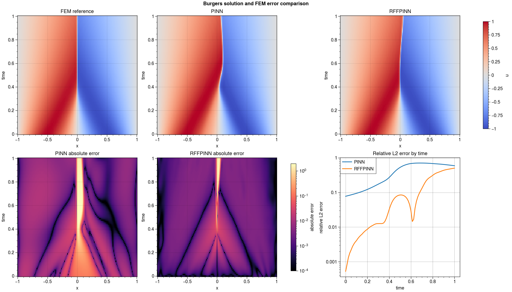
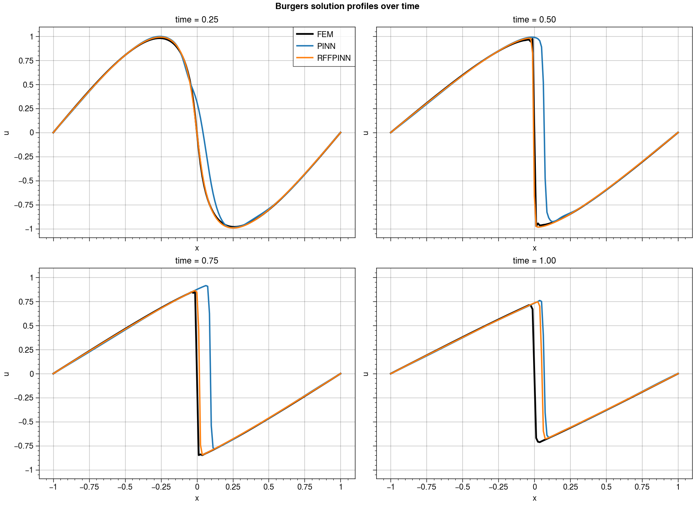
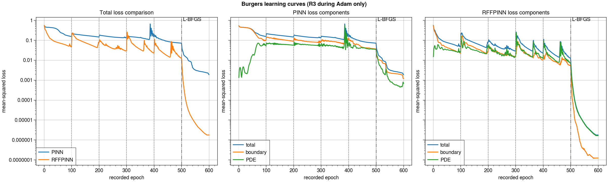

# Short Burgers Benchmark: PINN vs RFFPINN

Run on an NVIDIA GeForce RTX 4050 Laptop GPU using FP32 and seed 69. Both
models used width 16, depth 4, the same fixed sample budget, and 500 Adam
epochs at learning rate 0.004 followed by 100 L-BFGS epochs. Paper-style
fixed-budget R3 resampling was applied at Adam epochs 100, 200, 300, and 400;
the collocation points remained fixed throughout L-BFGS. RFFPINN used
`embed_dim=256` and `alpha=5.0`.

The reference was DeepFlow's converged NGSolve FEM solution with 100 spatial
elements, 100 time steps, and nonlinear tolerance `1e-8`. The evaluation grid
contained 161 spatial by 81 temporal points.

## Results

| Metric | PINN | RFFPINN |
| --- | ---: | ---: |
| Relative L2 error | 0.435811 | **0.161948** |
| Final-time relative L2 error | 0.591015 | **0.504758** |
| RMSE | 0.266483 | **0.099025** |
| MAE | 0.058582 | **0.012268** |
| Maximum absolute error | 1.967898 | **1.597451** |
| Final training loss | 0.001872 | **0.00000175** |
| Training time | 68.96 s | **66.84 s** |
| Trainable parameters | **881** | 4,945 |

Under this R3-plus-L-BFGS configuration, RFFPINN reduced full-field relative
L2 error by 62.8% and RMSE by 62.8% relative to PINN. It also produced about
1,068 times lower final sampled training loss. Both models still had substantial
final-time error, so the training schedule reduced but did not eliminate
temporal error propagation.

## Error evolution

| Time | PINN relative L2 | RFFPINN relative L2 |
| ---: | ---: | ---: |
| 0.00 | 0.077637 | **0.000528** |
| 0.25 | 0.144704 | **0.011233** |
| 0.50 | 0.529198 | **0.084643** |
| 0.75 | 0.699993 | **0.237603** |
| 1.00 | 0.591015 | **0.504758** |

RFFPINN was more accurate at every reported time. It closely matched the FEM
solution early in the interval, but its error rose as the shock propagated.







## Reference and interpretation notes

- A previous refinement check using 200 spatial elements and 200 time steps
  changed the FEM field by only 0.007425 relative L2.
- Dashed lines on the learning curves mark R3 resampling during Adam. The
  dash-dot line marks the transition to L-BFGS, during which no resampling
  occurs. Loss jumps at R3 events are expected because the collocation set
  changes.
- This is a one-seed, fixed-budget smoke benchmark, not a statistical ranking.
- The RFF model has 5.6 times more trainable parameters because its first dense
  layer consumes 256 embedded features.

Reproduce the run with:

```powershell
python benchmarks\comparing_rff_pinn_burgers\benchmark.py
```

Regenerate all plots from saved fields and histories without training:

```powershell
python benchmarks\comparing_rff_pinn_burgers\plot_results.py
```

Machine-readable metrics and aligned prediction fields are stored in
`results/metrics.json`, `results/fields.npz`, and
`results/training_history.npz`. Reconstruction-ready CPU checkpoints are
stored in `results/pinn_checkpoint.pt` and `results/rffpinn_checkpoint.pt`, so
postprocessing does not rerun training.
