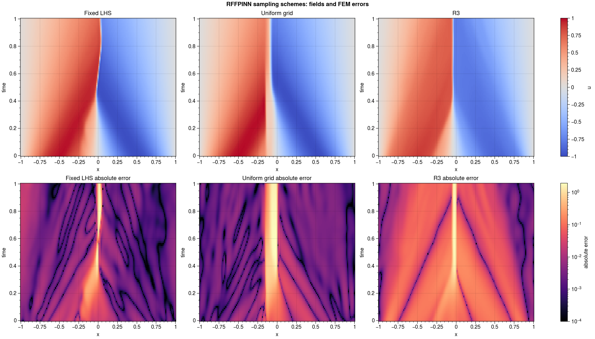
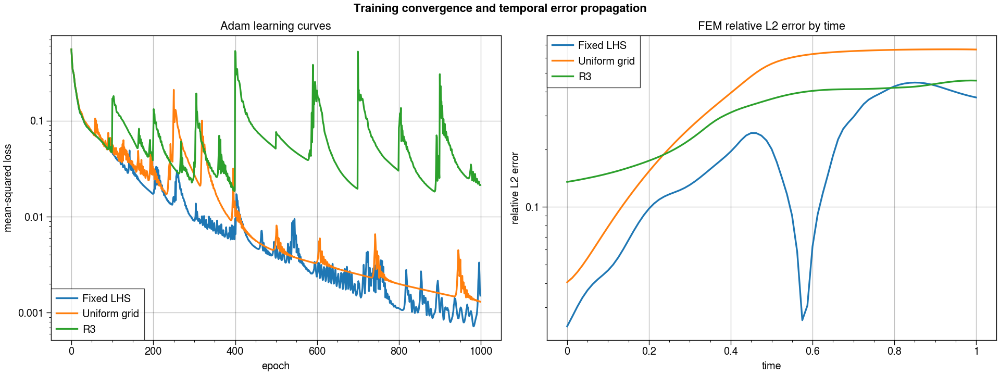
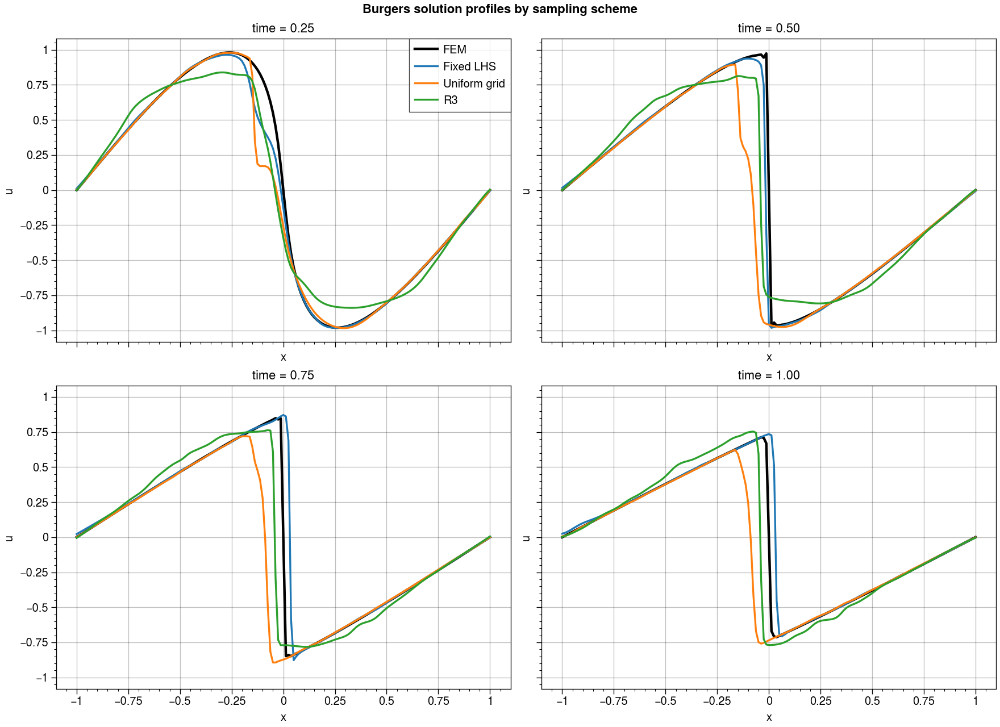

# Burgers RFFPINN Sampling Benchmark

This benchmark compares one identical RFFPINN under three collocation schemes:
fixed LHS, a fixed 32 by 32 uniform interior grid, and fixed-budget R3 initialized
from LHS and resampled every 100 Adam epochs. All runs use seed 69, `alpha=5`,
`embed_dim=256`, 1,024 interior points, the same boundary budgets, and 1,000
Adam epochs at learning rate 0.004. L-BFGS is disabled.

## Results

| Metric | Fixed LHS | Uniform | R3 |
| --- | ---: | ---: | ---: |
| Relative L2 error | **0.214410** | 0.443543 | 0.309584 |
| Final-time relative L2 | **0.372613** | 0.662355 | 0.456263 |
| RMSE | **0.131104** | 0.271210 | 0.189299 |
| MAE | **0.024280** | 0.066408 | 0.082158 |
| Maximum absolute error | **1.722232** | 1.948749 | 1.737613 |
| Final sampled loss | 0.001506 | **0.001301** | 0.021409 |
| Training time | 16.18 s | **14.95 s** | 15.82 s |

Fixed LHS was best in this one-seed experiment. Uniform sampling produced a
slightly lower training loss than LHS but 2.07 times its FEM relative L2 error.
This directly shows that symmetry and uniformity alone do not resolve the
RFFPINN generalization problem. R3 ranked between the two on relative L2 error.
Its larger final sampled loss is expected in part because the collocation set
changes nine times and Adam must repeatedly adapt to newly exposed residuals.

## Error by time

| Time | Fixed LHS | Uniform | R3 |
| ---: | ---: | ---: | ---: |
| 0.00 | **0.023885** | 0.040533 | 0.135244 |
| 0.25 | **0.116606** | 0.202494 | 0.193757 |
| 0.50 | **0.200568** | 0.558345 | 0.366014 |
| 0.75 | **0.376491** | 0.656049 | 0.413763 |
| 1.00 | **0.372613** | 0.662355 | 0.456263 |

LHS was more accurate at every reported time. Uniform sampling deteriorated
most strongly around and after shock formation, despite having no random gaps.
The result supports frequency conditioning and shock propagation as more
important causes than collocation asymmetry in this configuration.







This is a controlled single-seed benchmark, not a statistical ranking. Multiple
seeds and uniform-grid resolutions would be needed to estimate variance and
separate sampling design from optimizer sensitivity.

Run the benchmark with:

```powershell
python benchmarks\comparing_rffpinn_sampling_burgers\benchmark.py
```

Regenerate plots from saved results without training with:

```powershell
python benchmarks\comparing_rffpinn_sampling_burgers\plot_results.py
```

Each scheme has a reconstruction-ready checkpoint in `results/`, alongside the
metrics, aligned fields, and training histories used for postprocessing.
