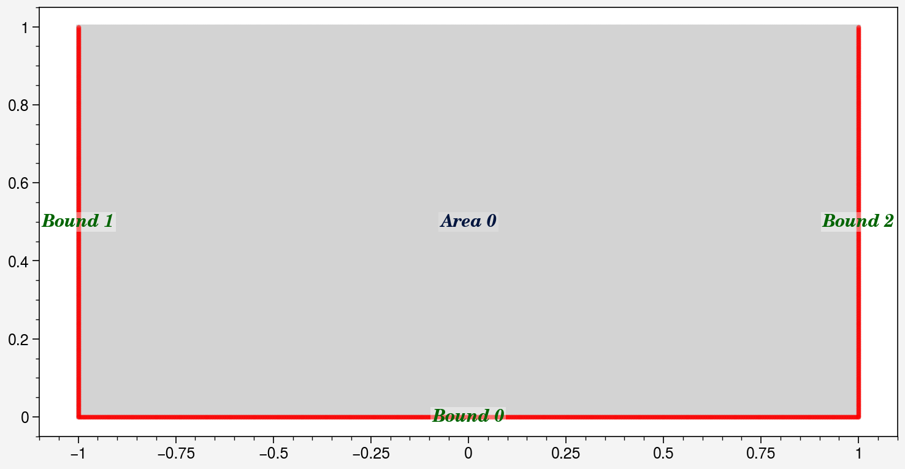
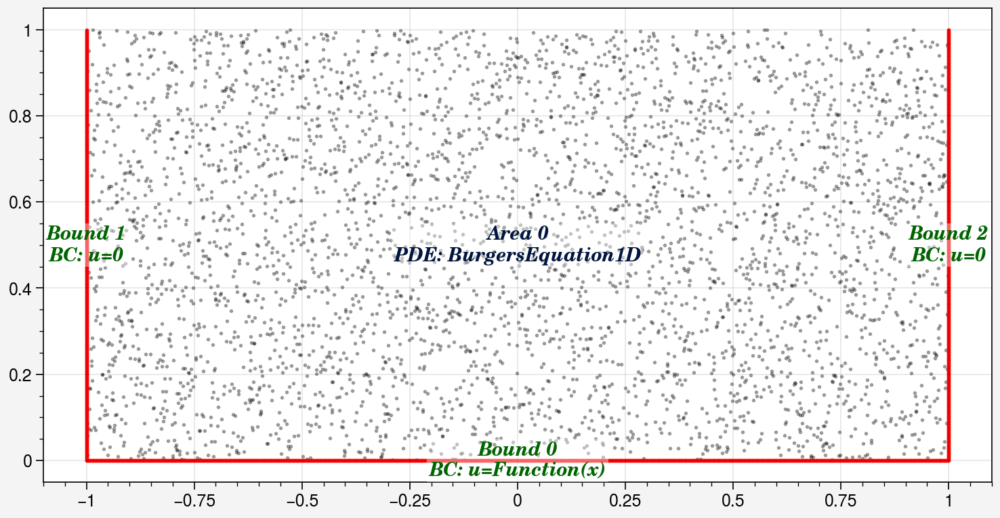
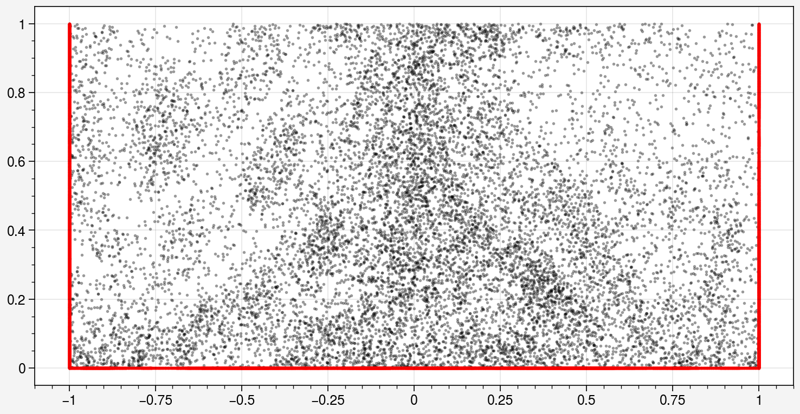
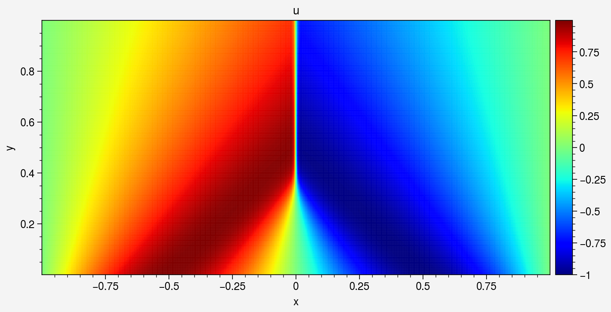
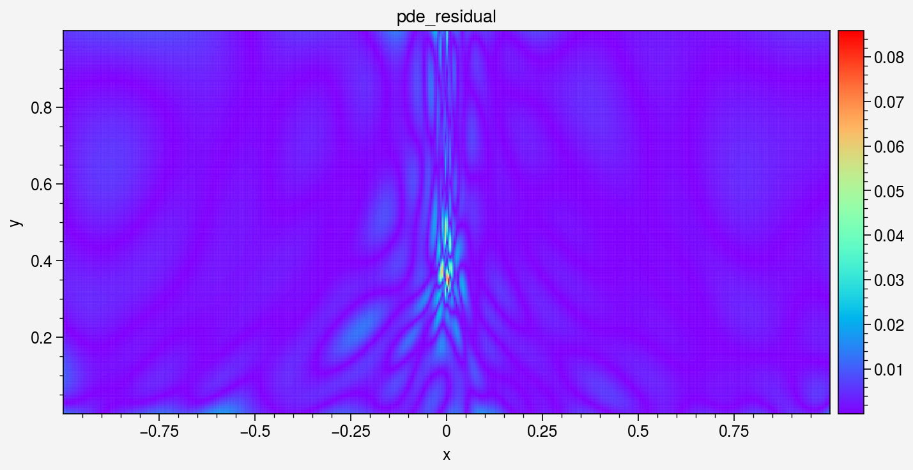
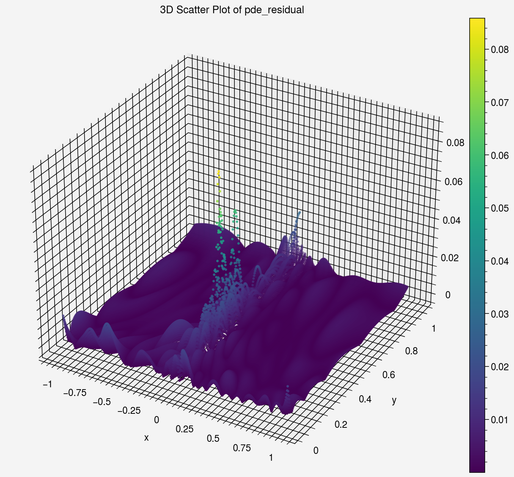
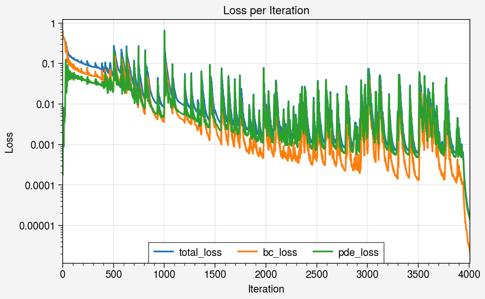
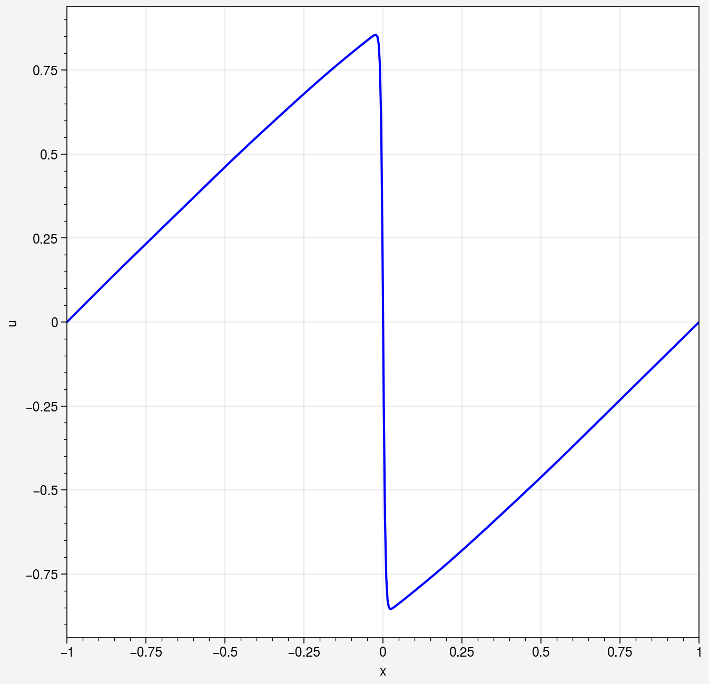

# Solving the 1D Burgers Equation

This example solves the one-dimensional Burgers equation in its steady 2D
embedding — the equation DeepFlow models as `BurgersEquation1D`. It is a good
first example: the geometry is trivial, but the solution develops a sharp
shock-like front that makes it a stress test for point sampling.

!!! note "At a glance"
    - **Physics**: `u_y + u · u_x = ν · u_xx` with `ν = 0.01/π` on the domain
      `x ∈ [-1, 1]`, `y ∈ [0, 1]`, where `y` plays the role of time. Initial
      condition `u(x, 0) = -sin(πx)`, homogeneous Dirichlet conditions
      `u = 0` at `x = ±1`.
    - **What to expect**: the smooth `-sin(πx)` profile steepens into a shock
      front as `y` grows, until it is absorbed by the `u = 0` boundary at
      `x = 1`. R3 resampling concentrates collocation points at the front.
    - **Setup cost**: FNN 16 × 4; Adam 4,000 epochs (lr 0.015) followed by
      L-BFGS 500 epochs; interior collocation points grow from 4,000 to
      ~13,000 via R3. Reference run: a few minutes on GPU.
    - **Verified against**: DeepFlow v0.1.3 (commit `828f392`).

## 1. Define the geometry

The domain is a rectangle; the initial condition and the two lateral
boundaries are separate `Line` geometries:

```python
import deepflow as df

df.manual_seed(69)  # for reproducibility

area = df.geometry.rectangle([-1, 1], [0, 1])
line_ic = df.geometry.line_horizontal(y=0, range_x=[-1, 1])
line_bc1 = df.geometry.line_vertical(x=-1, range_y=[0, 1])
line_bc2 = df.geometry.line_vertical(x=1, range_y=[0, 1])
domain = df.domain(area.area_list, line_ic, line_bc1, line_bc2)
domain.show_setup()
```



## 2. Define the physics

Attach the Burgers PDE to the area and the boundary/initial conditions to the
lines. DeepFlow uses hard boundary conditions, so `define_bc` both constrains
the network and generates the training data:

```python
from torch import sin, pi

domain.area_list[0].define_pde(df.pde.BurgersEquation1D(nu=0.01 / pi))
domain.bound_list[0].define_bc({'u': ['x', lambda x: -sin(pi * x)]})  # IC at y=0
domain.bound_list[1].define_bc({'u': 0})                              # x = -1
domain.bound_list[2].define_bc({'u': 0})                              # x = +1
```

## 3. Sample training data

Initial sampling with Latin Hypercube Sampling (LHS), 2,000 points on the
initial-condition line and 4,000 in the interior. `display_physics=True`
colors the points by their role:

```python
domain.sampling_lhs([2000, 1000, 1000], [4000])
domain.show_coordinates(display_physics=True)
```



## 4. Train the model

The shock front moves as training progresses, so a static point set wastes
samples. The R3 scheme
([arXiv:2207.02338](https://arxiv.org/abs/2207.02338)) re-samples every 500
Adam epochs, concentrating points where the residual is largest:

```python
def do_in_adam(epoch, model):
    if epoch % 500 == 0 and epoch > 0:
        domain.sampling_R3([2000, 1000, 1000], [4000])
        print(domain)

model0 = df.PINN(input_vars=['x', 'y'], output_vars=['u'], width=16, length=4)

model1, model1_best = model0.train_adam(
    calc_loss=df.calc_loss_simple(domain),
    learning_rate=0.015,
    epochs=4000,
    do_between_epochs=do_in_adam)

model2, model2_best = model1_best.train_lbfgs(
    calc_loss=df.calc_loss_simple(domain),
    epochs=500)
```

!!! note "Reference-run result"
    Adam (4,000 epochs) + L-BFGS (500 epochs) converged to
    `total_loss ≈ 2e-5`. The remaining error is dominated by the boundary
    residual near the shock front.

After training, `show_coordinates` reveals how R3 has densified the point
set around the shock:

```python
domain.show_coordinates(display_physics=False)
```



## 5. Visualize the solution

Evaluate the trained network on a uniform grid and plot the field, the PDE
residual, and the loss history:

```python
prediction = domain.area_list[0].evaluate(model2)
prediction.sampling_area([500, 250])

prediction.plot_color('u', cmap='jet', s=0.3).savefig('u_field.png')
_ = prediction.plot_color('pde_residual', cmap='rainbow', s=0.3)
_ = prediction.plot('pde_residual')
_ = prediction.plot_loss_curve(log_scale=True)
```






The shock front is clearly visible as a thin band of high PDE residual. A
1D slice at `y = 0.75` shows the steep front directly:

```python
line = df.geometry.line_horizontal(y=0.75, range_x=[-1, 1])
prediction = line.evaluate(model2)
prediction.sampling_line(500)
_ = prediction.plot(y_axis='u')
```



## 6. Optional: FEM reference comparison

If the `[cfd]` extra is installed (NGSolve backend), DeepFlow can solve the
same problem with a finite-element solver and report a mean absolute error
against the PINN solution:

```python
try:
    import ngsolve  # noqa: F401
except (ImportError, OSError) as exc:
    print(f'Skipping optional FEM comparison: {exc}')
else:
    import numpy as np

    fem_reference = domain.solve_fem(
        mesh_size=0.5,
        boundary_resolution=16,
        max_iterations=3,
    )
    fem_area = fem_reference.area_list[0]
    fem_area.sampling_area([100, 100])
    fem_values = fem_area['u_ref']
    pinn_area = domain.area_list[0].evaluate(model2_best)
    u_error = float(np.mean(np.abs(pinn_area.data_dict['u'] - fem_values)))
    if not np.isfinite(u_error):
        raise RuntimeError('FEM comparison produced a non-finite error')
    print(f'FEM mean absolute u error: {u_error:.6e}')
```

See [NGSolve reference solutions](reference-solutions.md) for the details of
the FEM backend.

## Run it yourself

Source notebook:
[`examples/burgers_eq/burgers_eq.ipynb`](https://github.com/YoYo-XYZ/pinn-deepflow/blob/dev/examples/burgers_eq/burgers_eq.ipynb)

```bash
jupyter notebook examples/burgers_eq/burgers_eq.ipynb
```

This page is hand-authored; the notebook is the source of truth (see
[REGENERATE.md](https://github.com/YoYo-XYZ/pinn-deepflow/blob/dev/REGENERATE.md)).
