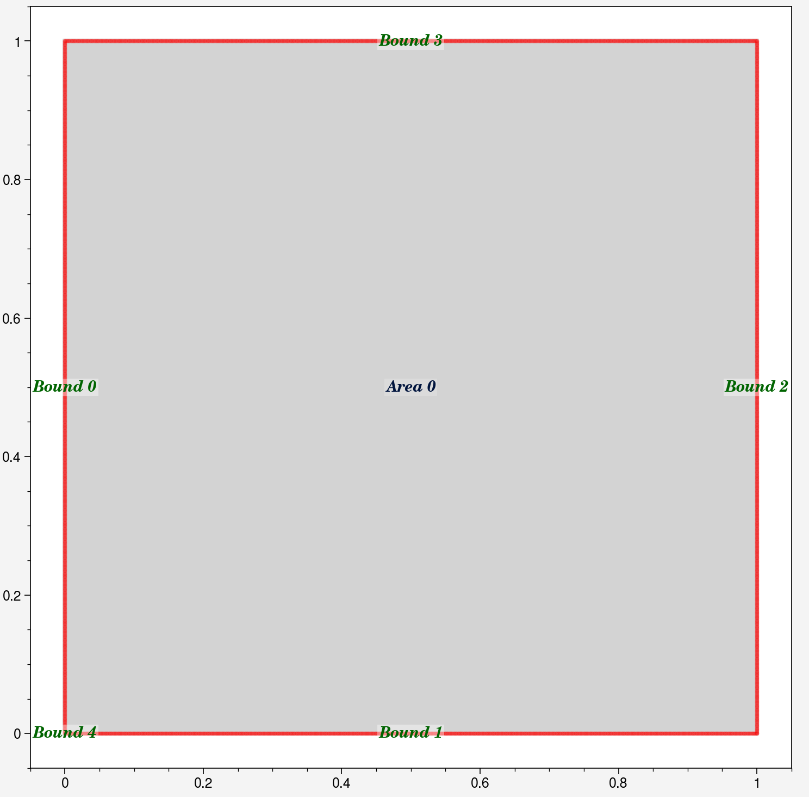
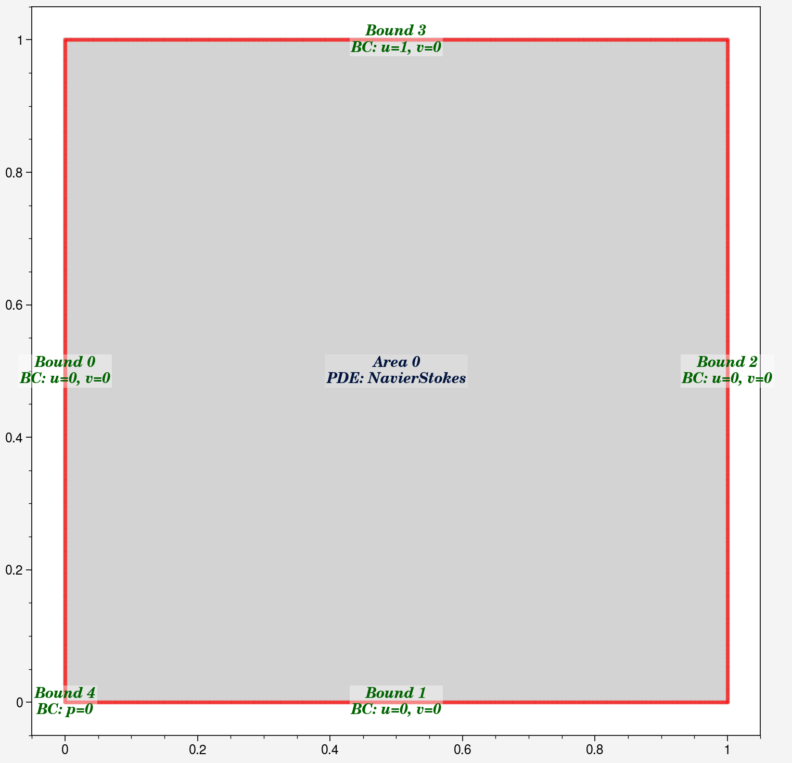
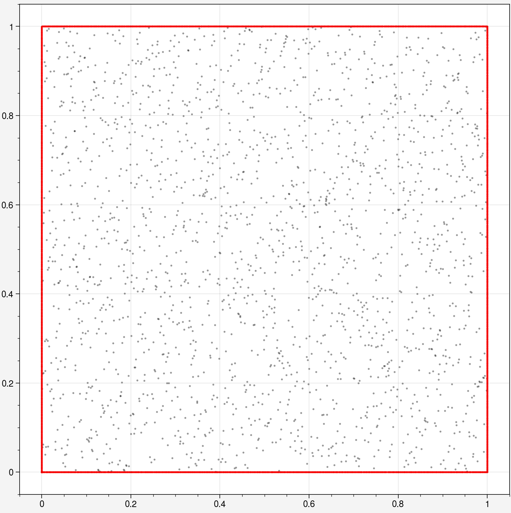
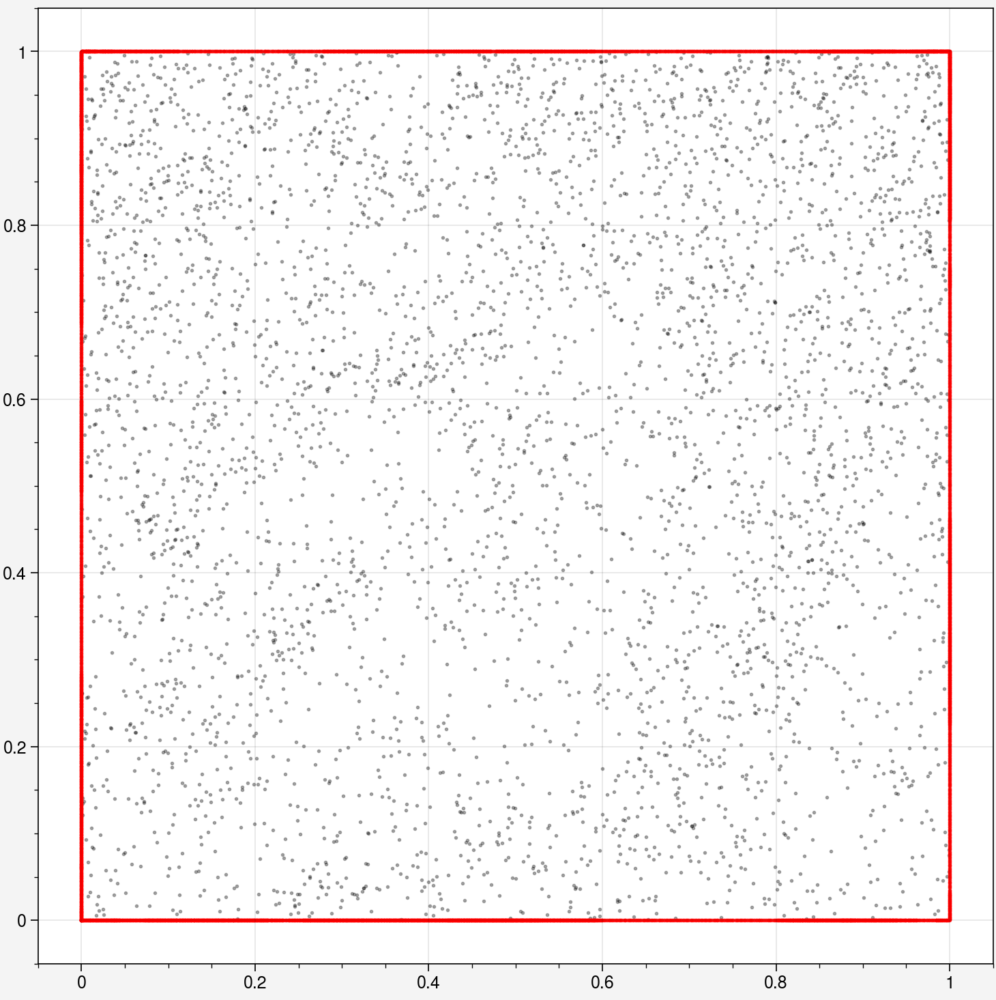
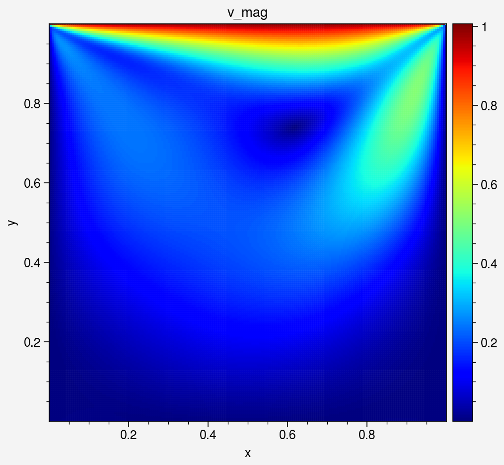
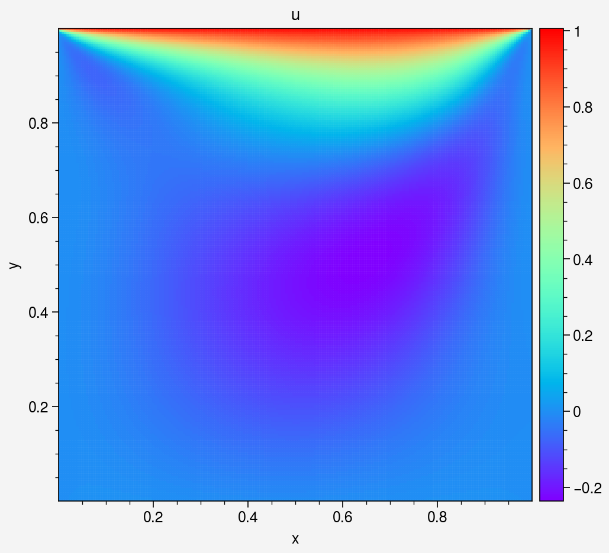
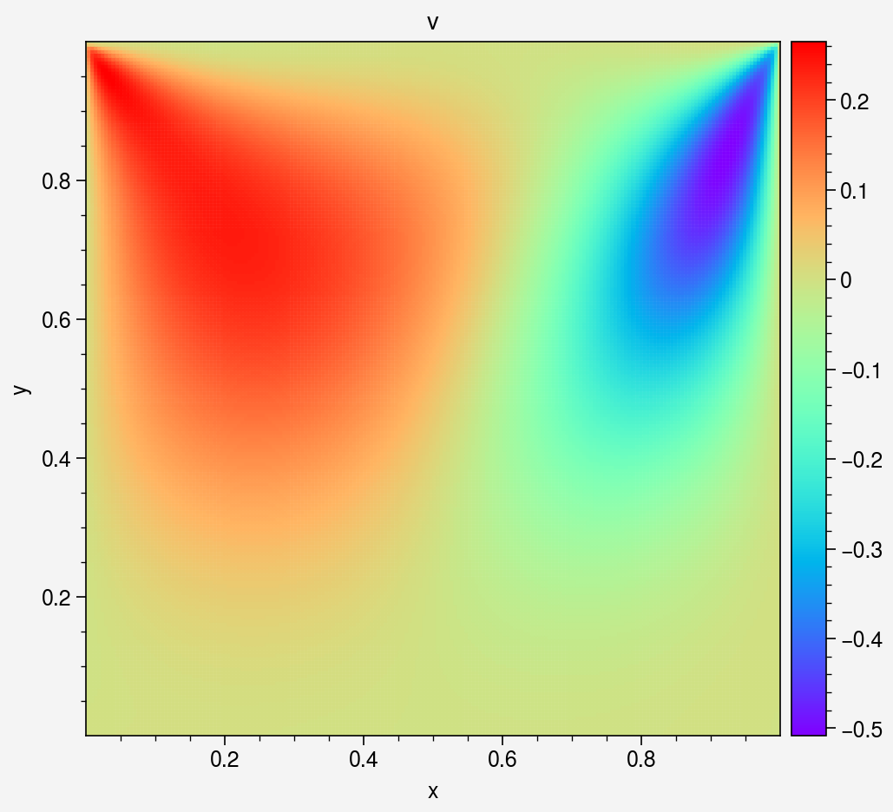
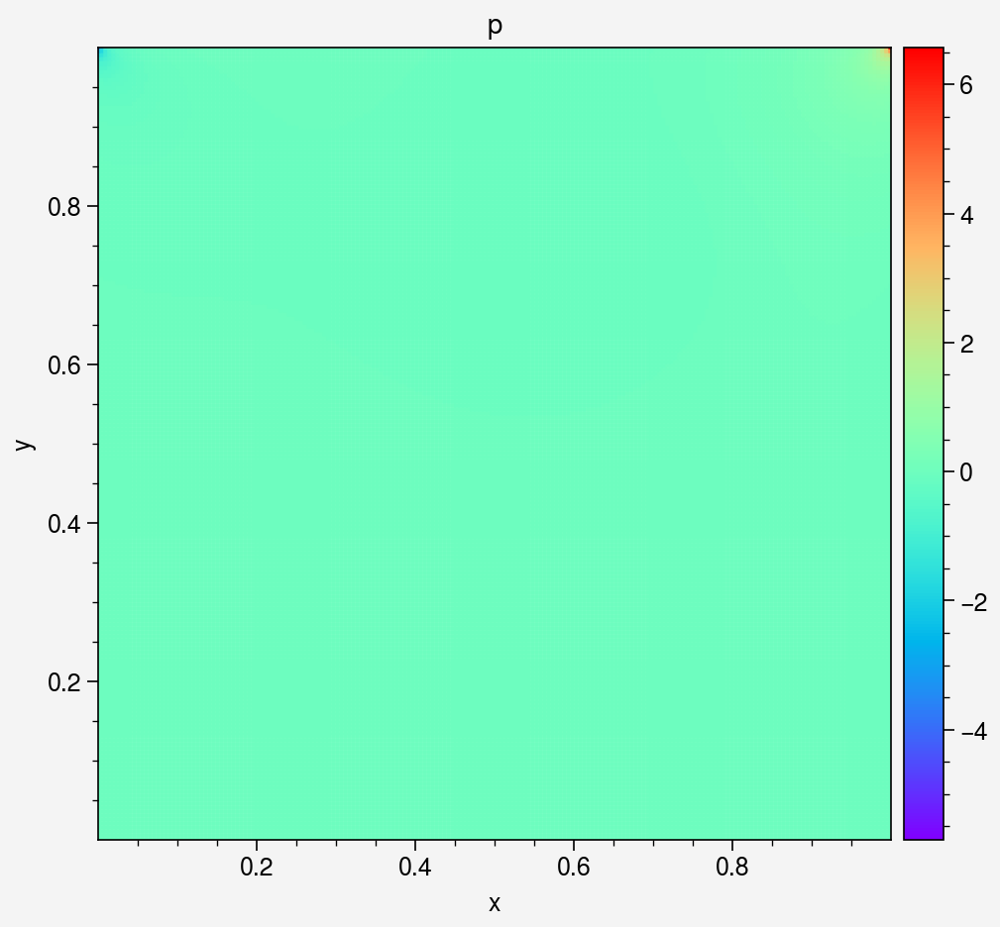
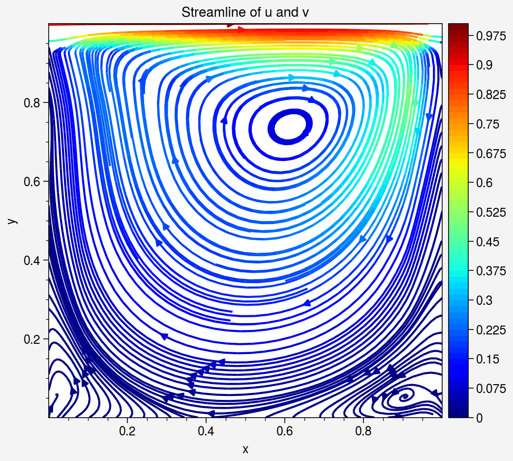
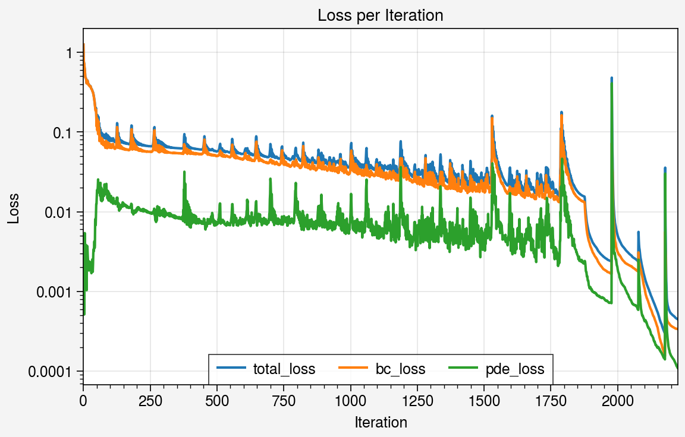

# Solving the Lid-Driven Cavity Flow (Steady)

This example solves the classic lid-driven cavity benchmark — a square cavity
whose top wall slides at constant velocity. It is a standard validation case
for incompressible flow solvers
([COMSOL's benchmark write-up](https://www.comsol.com/blogs/how-to-solve-a-classic-cfd-benchmark-the-lid-driven-cavity-problem)).

!!! note "At a glance"
    - **Physics**: steady incompressible Navier–Stokes equations,
      nondimensionalized with `(U, L) = (0.0001, 1)` and `mu = 0.001`,
      `rho = 1000` — Reynolds number `Re = ρUL/μ = 100`. Lid: `u = 1`,
      `v = 0`; other walls: no-slip; pressure pinned to `p = 0` at the
      corner point.
    - **What to expect**: a large primary vortex driven by the lid, with
      secondary corner vortices at low Reynolds number. Verify: the
      `u`-velocity profile is antisymmetric about the cavity mid-line.
    - **Setup cost**: FNN 50 × 5 (outputs `u, v, p`); Adam 2,000 epochs
      (lr 0.004) followed by L-BFGS 350 epochs (threshold 1e-4). Reference
      run: a few minutes on GPU, final `total_loss ≈ 3e-4`.
    - **Verified against**: DeepFlow v0.1.3 (candidate source commit `9f751fe`).

## 1. Define the geometry

A square plus a corner point. The point is passed to the domain as a second
geometry and receives the pressure reference condition:

```python
import deepflow as df

df.manual_seed(69)  # for reproducibility

rectangle = df.geometry.rectangle([0, 1], [0, 1])
point = df.geometry.point(0, 0)

domain = df.domain(rectangle, point)
domain.show_setup()
```



## 2. Define the physics

```python
domain.bound_list[0].define_bc({'u': 0, 'v': 0})  # Bottom wall
domain.bound_list[1].define_bc({'u': 0, 'v': 0})  # Left wall
domain.bound_list[2].define_bc({'u': 0, 'v': 0})  # Right wall
domain.bound_list[3].define_bc({'u': 1, 'v': 0})  # Lid
domain.bound_list[4].define_bc({'p': 0})          # Corner point: pressure reference
domain.area_list[0].define_pde(df.NavierStokes(U=0.0001, L=1, mu=0.001, rho=1000))
domain.show_setup()
```



## 3. Sample training data

1,000 LHS points per boundary (10 on the corner point) and 2,000 interior:

```python
domain.sampling_lhs(bound_sampling_res=[1000, 1000, 1000, 1000, 10], area_sampling_res=[2000])
domain.show_coordinates(display_physics=False)
```



## 4. Train the model

R3 resampling during Adam keeps the collocation points where the residual is
largest:

```python
def do_in_adam(epoch, model):
    if epoch % 100 == 0 and epoch > 0:
        domain.sampling_R3(bound_sampling_res=[1000, 1000, 1000, 1000], area_sampling_res=[2000])
        print(domain)

model0 = df.PINN(width=50, length=5, input_vars=['x', 'y'], output_vars=['u', 'v', 'p'])

model1, model1_best = model0.train_adam(
    learning_rate=0.004,
    epochs=2000,
    calc_loss=df.calc_loss_simple(domain),
    threshold_loss=0.005,
    do_between_epochs=do_in_adam)

model2, model2_best = model1_best.train_lbfgs(
    calc_loss=df.calc_loss_simple(domain),
    epochs=350,
    threshold_loss=0.0001)
```

!!! note "Reference-run result"
    Adam (2,000 epochs) + L-BFGS (350 epochs) reached `total_loss ≈ 3e-4`,
    below the 1e-4 threshold on the way to 3e-4. The BC residual dominates —
    the lid corners are the hardest part of this problem.

After training, the resampled coordinates show where the solver spent its
points:

```python
domain.show_coordinates()
```



Save (and reload) the trained model:

```python
model2.save("model.pt")
model2 = df.load_model("model.pt")
```

## 5. Visualize the solution

Evaluate on a uniform grid, derive the velocity magnitude, and plot the
fields:

```python
df.Visualizer.refwidth_default = 4

area_eval = domain.area_list[0].evaluate(model2)
area_eval.sampling_area([200, 200])
print(area_eval)

area_eval['v_mag'] = (area_eval['u']**2 + area_eval['v']**2)**0.5

_ = area_eval.plot_color('v_mag', s=1.5, cmap='jet').savefig("colorplot_v_mag.png")
_ = area_eval.plot_color('u', s=1.5, cmap='rainbow')
_ = area_eval.plot_color('v', s=1.5, cmap='rainbow')
_ = area_eval.plot_color('p', s=1.5, cmap='rainbow')
_ = area_eval.plot_streamline('u', 'v', cmap='jet')
```







The streamlines show the primary clockwise vortex; the pressure field is
pinned by the corner point condition. Plot the training loss:

```python
_ = area_eval.plot_loss_curve(log_scale=True)
```



### Export data

```python
import numpy as np

x_data = area_eval.data_dict['x']
y_data = area_eval.data_dict['y']
u_data = area_eval.data_dict['u']

array = np.column_stack((x_data, y_data, u_data))
np.savetxt('outlet_velocity.txt', array)
```

## 6. Optional: FEM reference comparison

With the `[cfd]` extra installed, compare against the NGSolve backend:

```python
try:
    import ngsolve  # noqa: F401
except (ImportError, OSError) as exc:
    print(f'Skipping optional FEM comparison: {exc}')
else:
    import numpy as np

    fem_reference = domain.solve_fem(
        mesh_size=0.2,
        boundary_resolution=32,
        max_iterations=20,
    )
    fem_area = fem_reference.area_list[0]
    fem_area.sampling_area([100, 100])
    fem_values = fem_area['u_ref']
    pinn_area = domain.area_list[0].evaluate(model2_best)
    u_error = float(np.mean(np.abs(pinn_area.data_dict['u'] - fem_values)))
    if not np.isfinite(u_error):
        raise RuntimeError('FEM comparison produced a non-finite error')
    print(f'FEM mean absolute u error: {u_error:.6e}')
```

## Run it yourself

Source notebook:
[`examples/cavity_flow_steady/cavity_flow_steady.ipynb`](https://github.com/YoYo-XYZ/pinn-deepflow/blob/dev/examples/cavity_flow_steady/cavity_flow_steady.ipynb)

```bash
jupyter notebook examples/cavity_flow_steady/cavity_flow_steady.ipynb
```

This page is hand-authored; the notebook is the source of truth (see
[REGENERATE.md](https://github.com/YoYo-XYZ/pinn-deepflow/blob/dev/REGENERATE.md)).
