# Solving the Transient Channel Flow

This example solves the start-up of incompressible flow in a channel: the
fluid is initially at rest and accelerates under a parabolic inflow until a
steady Poiseuille-like profile is established. It is the introductory example
for time-dependent problems — the network takes `t` as an input and the
domain is given a time range.

!!! note "At a glance"
    - **Physics**: unsteady incompressible Navier–Stokes equations on
      `[0, 5] × [0, 1]`, `t ∈ [0, 10]`, with `mu = 0.001`, `rho = 1000`,
      `U = 0.001` (Reynolds number `Re = ρUL/μ = 1`). Parabolic inflow
      (max `u = 1` at mid-height), no-slip walls, `p = 0` at the outlet,
      initial condition `u = v = 0`.
    - **What to expect**: the parabolic inflow profile propagates through the
      channel; the flow approaches a steady Poiseuille profile. The animation
      shows the `u` field from rest to quasi-steady state.
    - **Setup cost**: FNN 50 × 5 (inputs `x, y, t`); Adam 1,000 epochs
      (lr 0.001) followed by L-BFGS 350 epochs (threshold 1e-4). Reference
      run: a few minutes on GPU, final `total_loss ≈ 8e-4`.
    - **Verified against**: DeepFlow v0.1.3 (candidate source commit `9f751fe`).

## 1. Define the geometry

Two overlapping rectangles: the first carries the PDE and boundary
conditions, the second carries the initial condition:

```python
import deepflow as df

df.manual_seed(69)  # for reproducibility

rectangle_pde = df.geometry.rectangle([0, 5], [0, 1])
rectange_ic = df.geometry.rectangle([0, 5], [0, 1])

domain = df.domain(rectangle_pde, rectange_ic.area_list)
domain.show_setup()
```

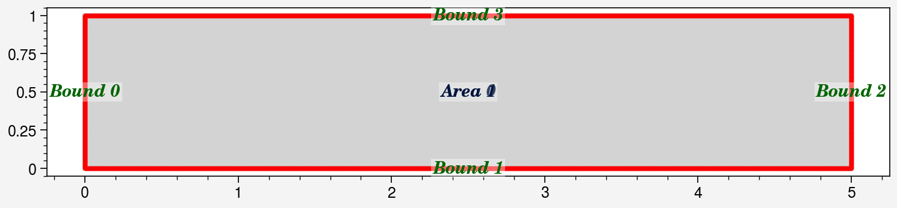

## 2. Define the physics

```python
domain.bound_list[0].define_bc({'u': df.parabolic('y', 1, 1, 0.5), 'v': 0})  # Inlet
domain.bound_list[1].define_bc({'u': 0, 'v': 0})  # Bottom wall
domain.bound_list[2].define_bc({'p': 0})          # Outlet
domain.bound_list[3].define_bc({'u': 0, 'v': 0})  # Top wall
domain.area_list[0].define_pde(df.NavierStokes(U=0.001, L=1, mu=0.001, rho=1000))
domain.area_list[1].define_ic({'u': 0, 'v': 0})

for geom in domain:
    geom.define_time([0, 10], 'random')

domain.show_setup()
```

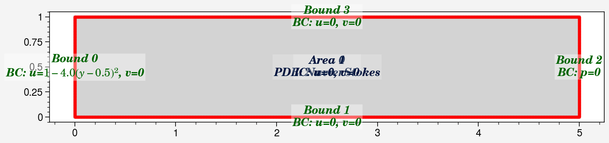

!!! note
    `define_time` without an explicit `expo_scaling` argument emits the
    warning `expo_scaling has not yet defined. False is set as default.` —
    that is expected; pass `expo_scaling=False` to silence it (see the
    [FAQ](faq.md)).

## 3. Sample training data

```python
domain.sampling_lhs(bound_sampling_res=[1000, 1000, 1000, 1000], area_sampling_res=[2000, 2000])
domain.show_coordinates(display_physics=False)
```

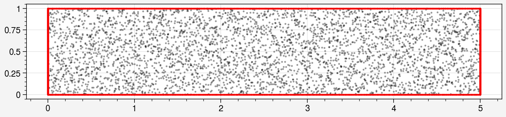

## 4. Train the model

R3 resampling runs every 100 Adam epochs. The notebook also verifies that
resampling never empties a region of the time interval — important for
transient problems:

```python
import torch

def check_time_coverage():
    for geometry in domain.bound_list + domain.area_list:
        if geometry.physics_type == 'IC' or not isinstance(geometry.range_t, (tuple, list)):
            continue
        times = geometry.t
        start, end = map(float, geometry.range_t)
        edges = torch.linspace(start, end, 9, dtype=times.dtype, device=times.device)
        covered_bins = torch.unique(torch.bucketize(times.detach(), edges[1:-1])).numel()
        if covered_bins < 8:
            raise RuntimeError(f'Insufficient time coverage after R3: {covered_bins}/8 bins')
    print('R3 time coverage: all non-initial geometries span the full time interval')

def do_in_adam(epoch, model):
    if epoch % 100 == 0 and epoch > 0:
        domain.sampling_R3(bound_sampling_res=[1000, 1000, 1000, 1000], area_sampling_res=[2000, 2000])
        check_time_coverage()
        print(domain)

check_time_coverage()

model0 = df.PINN(width=50, length=5, input_vars=['x', 'y', 't'], output_vars=['u', 'v', 'p'])

model1, model1_best = model0.train_adam(
    learning_rate=0.001,
    epochs=1000,
    calc_loss=df.calc_loss_simple(domain),
    threshold_loss=0.005,
    do_between_epochs=do_in_adam)

model2, model2_best = model1_best.train_lbfgs(
    calc_loss=df.calc_loss_simple(domain),
    epochs=350,
    threshold_loss=0.0001)
```

!!! note "Reference-run result"
    Adam (1,000 epochs) + L-BFGS (350 epochs) reached `total_loss ≈ 8e-4`,
    short of the 1e-4 threshold. The IC residual (start-up front) and the BC
    residual near the inlet are the dominant terms.

```python
domain.show_coordinates()
```

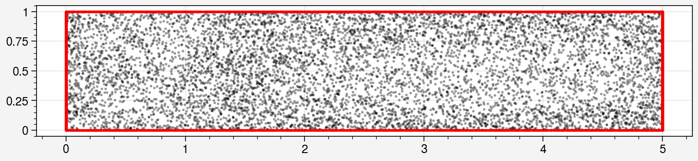

Save (and reload) the trained model:

```python
model2.save_as_pickle("model.pkl")
model2 = df.load_from_pickle("model.pkl")
```

## 5. Visualize the solution

Evaluate at `t = 10` and plot the fields:

```python
df.Visualizer.refwidth_default = 6

area_eval = domain.area_list[0].evaluate(model2)
area_eval.sampling_area([400, 80])
area_eval.define_time(10)
print(area_eval)

area_eval['v_mag'] = (area_eval['u']**2 + area_eval['v']**2)**0.5

_ = area_eval.plot_color('v_mag', s=2, cmap='jet').savefig("colorplot_v_mag.png")
_ = area_eval.plot_color('u', s=2, cmap='rainbow')
_ = area_eval.plot_color('v', s=2, cmap='rainbow')
_ = area_eval.plot_color('p', s=2, cmap='rainbow')
_ = area_eval.plot_streamline('u', 'v', cmap='jet')
_ = area_eval.plot_color('pde_residual', s=2, cmap='viridis')
```

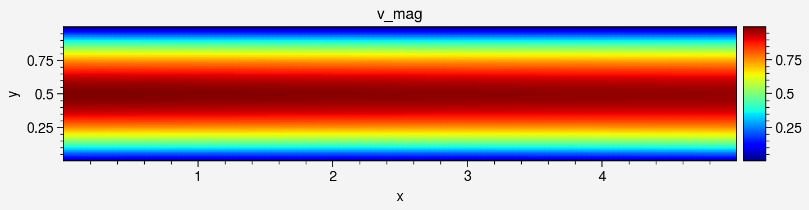
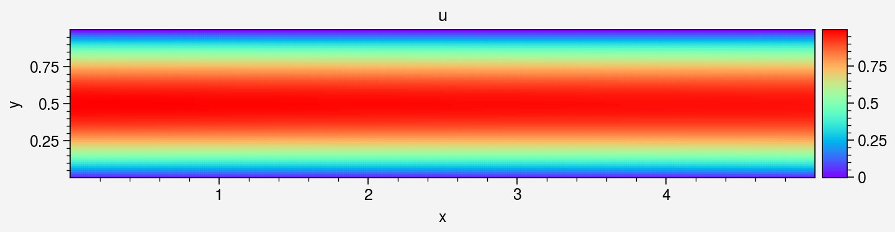
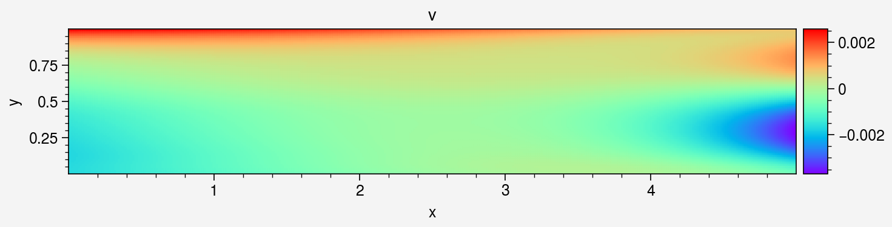
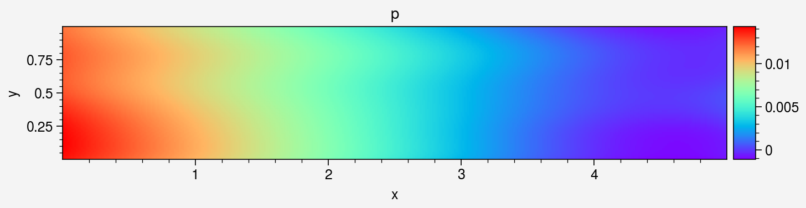
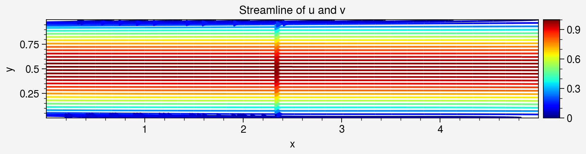
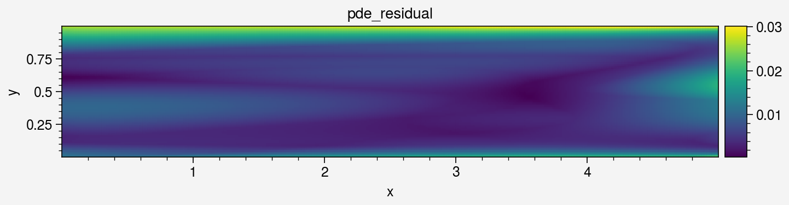

Animate the `u` field from rest to quasi-steady state:

```python
anim = area_eval.plot_animate(
    'u',
    range_t=[0.05, 8.1],
    dt=0.1,
    frame_interval=100,
    cmap='rainbow',
    s=1,
    color_range=[0, 1],
)
anim.save("animation.gif")
```


Training loss:

```python
_ = area_eval.plot_loss_curve(log_scale=True)
```

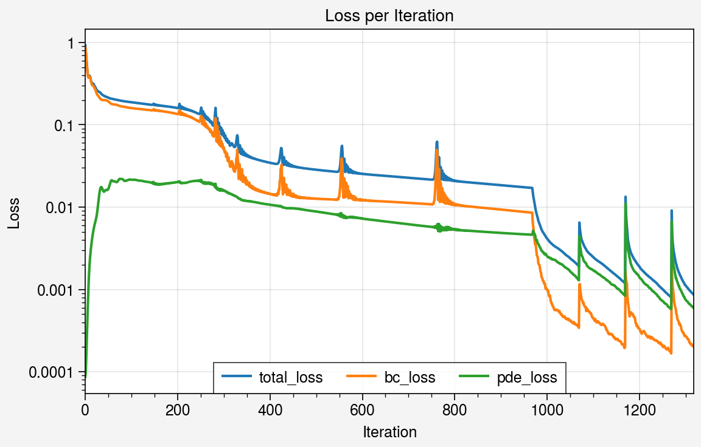

### Export data

```python
import numpy as np

x_data = area_eval.data_dict['x']
y_data = area_eval.data_dict['y']
u_data = area_eval.data_dict['u']

array = np.column_stack((x_data, y_data, u_data))
np.savetxt('outlet_velocity.txt', array)
```

## 6. Optional: FEM reference comparison

The NGSolve backend solves the transient problem with time stepping; the
mean absolute `u` error is reported at the final time:

```python
try:
    import ngsolve  # noqa: F401
except (ImportError, OSError) as exc:
    print(f'Skipping optional FEM comparison: {exc}')
else:
    import numpy as np

    time_interval = [0, 10]
    domain.area_list[0].define_time(time_interval, sampling_scheme='random')
    fem_reference = domain.solve_fem(
        mesh_size=0.4,
        boundary_resolution=32,
        time_step=1.0,
        max_iterations=10,
    )
    fem_area = fem_reference.area_list[0]
    query_time = float(time_interval[1])
    fem_area.sampling_area([100, 40])
    fem_area.define_time(query_time)
    fem_values = fem_area['u_ref']
    pinn_area = domain.area_list[0].evaluate(model2_best)
    u_error = float(np.mean(np.abs(pinn_area.data_dict['u'] - fem_values)))
    if not np.isfinite(u_error):
        raise RuntimeError('FEM comparison produced a non-finite error')
    print(f'FEM mean absolute u error at t={query_time:g}: {u_error:.6e}')
```

## Run it yourself

Source notebook:
[`examples/channel_flow_transient/channel_flow_transient.ipynb`](https://github.com/YoYo-XYZ/pinn-deepflow/blob/dev/examples/channel_flow_transient/channel_flow_transient.ipynb)

```bash
jupyter notebook examples/channel_flow_transient/channel_flow_transient.ipynb
```

This page is hand-authored; the notebook is the source of truth (see
[REGENERATE.md](https://github.com/YoYo-XYZ/pinn-deepflow/blob/dev/REGENERATE.md)).
