# Solving Steady Flow around a Cylinder

This example solves steady incompressible flow around a circular cylinder in a
channel — a classic benchmark for flow solvers, here following the setup of
[arXiv:2002.10558](https://arxiv.org/abs/2002.10558). It demonstrates boolean
geometry (rectangle minus circle) and a non-trivial inflow profile.

!!! note "At a glance"
    - **Physics**: steady incompressible Navier–Stokes equations with
      `mu = 0.02`, `rho = 1`, `U = 1` (`Re ≈ 50` on the unit length scale).
      Parabolic inflow with maximum `u = 1` at mid-height, no-slip walls and
      cylinder surface, `p = 0` at the outlet.
    - **What to expect**: a steady, symmetric wake behind the cylinder with a
      small recirculation zone — at this Reynolds number there is no vortex
      shedding (that requires `Re ≈ 40–47` based on the cylinder diameter).
      Verify the wake symmetry about the channel mid-line.
    - **Setup cost**: FNN 32 × 5 (outputs `u, v, p`); Adam 2,000 epochs
      (lr 0.004) followed by L-BFGS 450 epochs (threshold 1e-4); 4,000
      interior points growing to ~7,000 via R3. Reference run: a few minutes
      on GPU.
    - **Verified against**: DeepFlow v0.1.3 (commit `828f392`).

## 1. Define the geometry

The cylinder is subtracted from the channel with the `-` operator; its
boundaries are passed to the domain so they get sampled as obstacles:

```python
import deepflow as df

df.manual_seed(69)  # for reproducibility

circle = df.geometry.circle(0.2, 0.2, 0.05)
rectangle = df.geometry.rectangle([0, 1.1], [0, 0.41])
area = rectangle - circle

domain = df.domain(area, circle.bound_list)
domain.show_setup()
```

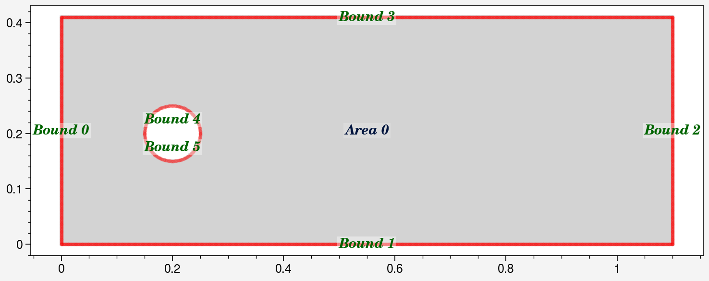

## 2. Define the physics

```python
domain.bound_list[0].define_bc({'u': ['y', lambda x: 4 * 1 * (0.41 - x) * x / 0.41**2], 'v': 0})  # Inlet
domain.bound_list[1].define_bc({'u': 0, 'v': 0})  # Bottom wall
domain.bound_list[2].define_bc({'p': 0})          # Outlet
domain.bound_list[3].define_bc({'u': 0, 'v': 0})  # Top wall
domain.bound_list[4].define_bc({'u': 0, 'v': 0})  # Cylinder
domain.bound_list[5].define_bc({'u': 0, 'v': 0})  # Cylinder
domain.area_list[0].define_pde(df.NavierStokes(U=1, L=1, mu=0.02, rho=1))
domain.show_setup()
```

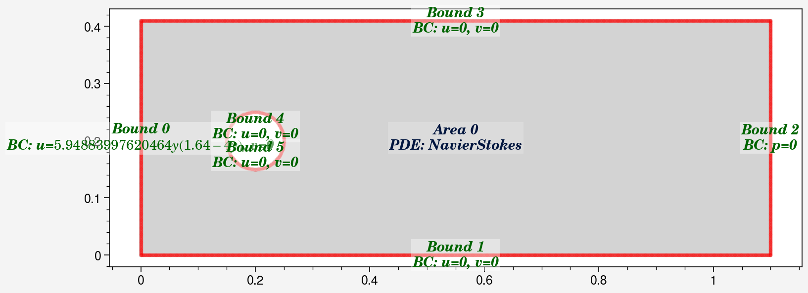

## 3. Sample training data

```python
domain.sampling_lhs(bound_sampling_res=[1000, 1000, 1000, 1000, 1000, 1000], area_sampling_res=[4000])
domain.show_coordinates(display_physics=False)
```

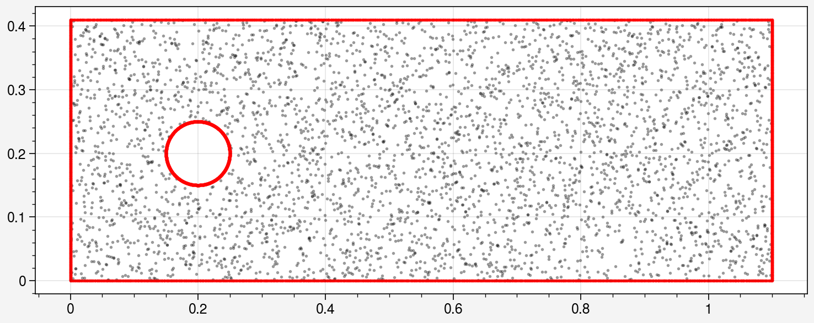

## 4. Train the model

```python
def do_in_adam(epoch, model):
    if epoch % 100 == 0 and epoch > 0:
        domain.sampling_R3(bound_sampling_res=[1000, 1000, 1000, 1000, 1000, 1000], area_sampling_res=[4000])
        print(domain)

model0 = df.PINN(width=32, length=5, input_vars=['x', 'y'], output_vars=['u', 'v', 'p'])

model1, model1_best = model0.train_adam(
    learning_rate=0.004,
    epochs=2000,
    calc_loss=df.calc_loss_simple(domain),
    threshold_loss=0.01,
    do_between_epochs=do_in_adam)

model2, model2_best = model1_best.train_lbfgs(
    calc_loss=df.calc_loss_simple(domain),
    epochs=450,
    threshold_loss=0.0001)
```

!!! note "Reference-run result"
    Adam (2,000 epochs) dropped `total_loss` to ≈ 0.2; L-BFGS (450 epochs)
    pushed it below 1e-3 before the run was interrupted. The momentum
    residuals near the cylinder surface dominate the remaining error.

```python
domain.show_coordinates()
```

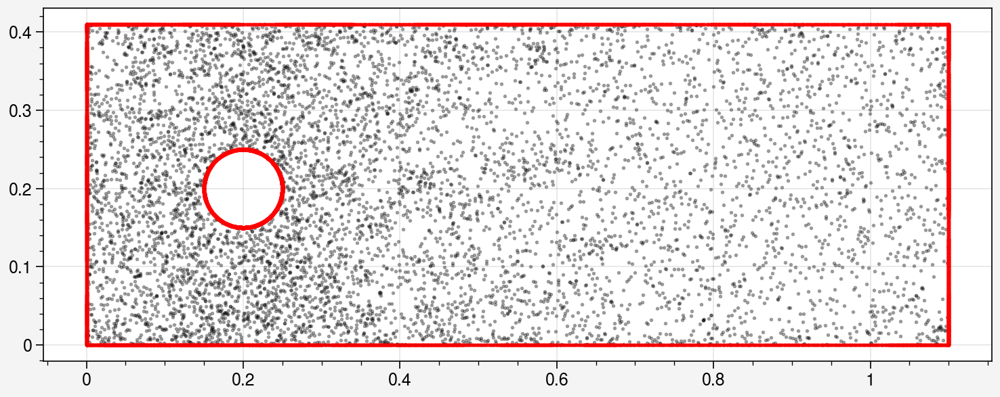

Save (and reload) the trained model:

```python
model2.save_as_pickle("model.pkl")
model2 = df.load_from_pickle("model.pkl")
```

## 5. Visualize the solution

```python
area_eval = domain.area_list[0].evaluate(model2)
area_eval.sampling_area([300, 150])
print(area_eval)

_ = area_eval.plot_color('u', s=2, cmap='rainbow').savefig("colorplot_u.png")
_ = area_eval.plot_color('v', s=2, cmap='rainbow')
_ = area_eval.plot_color('p', s=2, cmap='rainbow')
_ = area_eval.plot_streamline('u', 'v', cmap='jet')
_ = area_eval.plot('pde_residual')
```

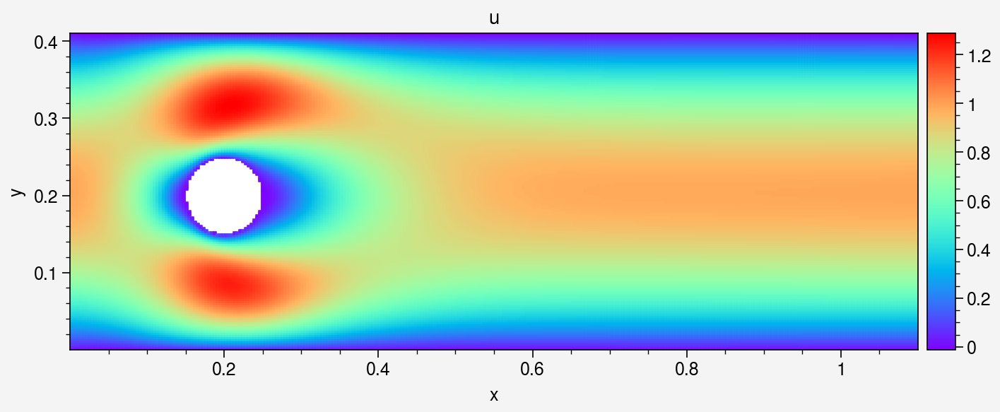
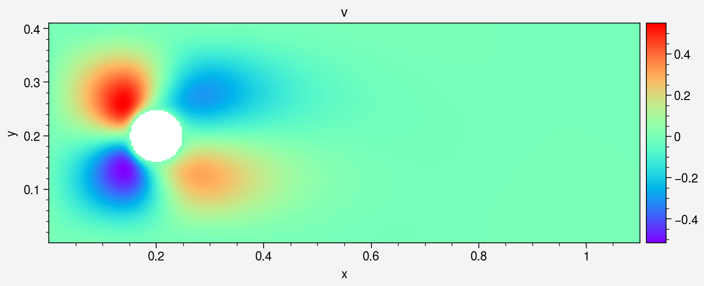
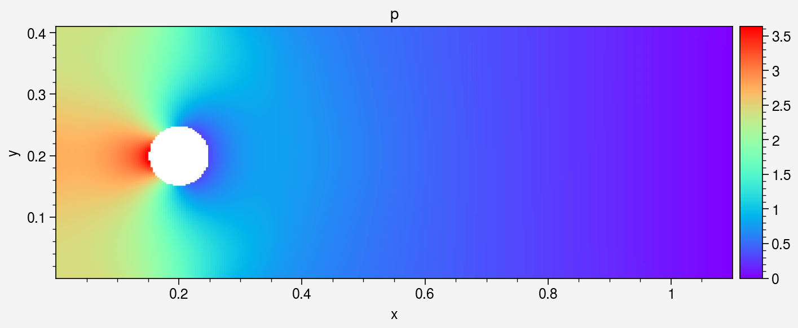
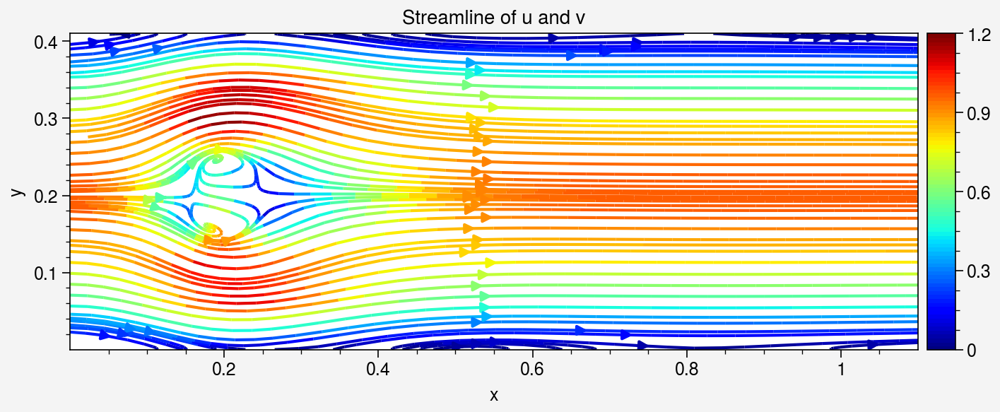
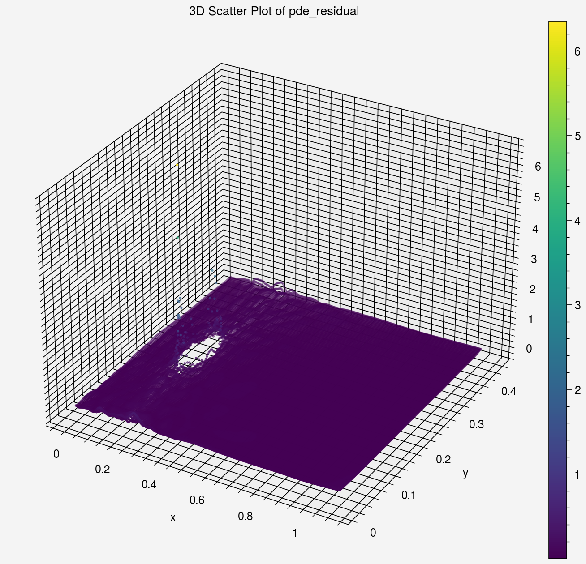

The streamlines show the steady recirculation zone behind the cylinder. The
residual plot concentrates error near the cylinder and the inlet corners.

Check the outflow profile against the inflow: the outlet (`bound_list[2]`)
should carry a parabolic `u` profile:

```python
bound_visual = domain.bound_list[2].evaluate(model2)
bound_visual.sampling_line(200)

_ = bound_visual.plot_color('u', cmap='rainbow')
_ = bound_visual.plot(x_axis='y', y_axis='u')
```

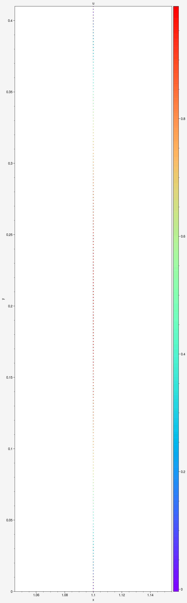
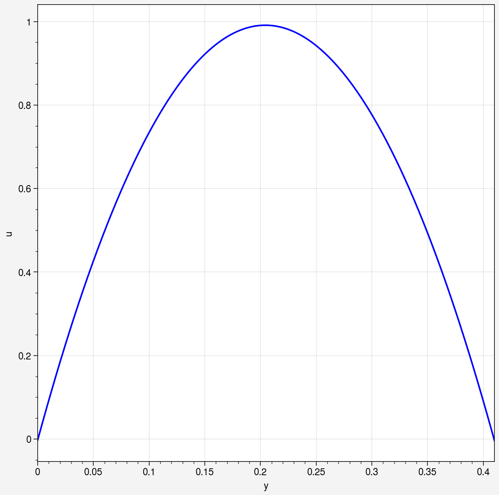

Training loss:

```python
_ = bound_visual.plot_loss_curve(log_scale=True)
```

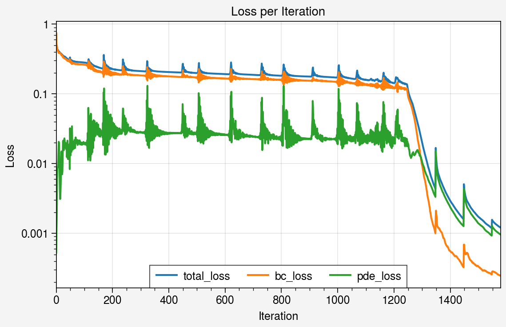

### Export data

```python
import numpy as np

x_data = bound_visual.data_dict['x']
y_data = bound_visual.data_dict['y']
u_data = bound_visual.data_dict['u']

array = np.column_stack((x_data, y_data, u_data))
np.savetxt('outlet_velocity.txt', array)
```

## 6. Optional: FEM reference comparison

The NGSolve backend solves the same steady problem on a triangular mesh;
`fem_reference.metadata` reports the solve configuration, and `u_ref` is the
FEM field queried at the same coordinates:

```python
try:
    import ngsolve  # noqa: F401
except (ImportError, OSError) as exc:
    print(f'Skipping optional FEM comparison: {exc}')
else:
    import numpy as np

    fem_reference = domain.solve_fem(
        mesh_size=0.05,
        boundary_resolution=64,
        max_iterations=200,
    )
    fem_area = fem_reference.area_list[0]
    fem_area.sampling_area([300, 150])
    print(fem_reference.metadata)
    _ = fem_area.plot_color('u_ref', s=2, cmap='rainbow')

    pinn_area = domain.area_list[0].evaluate(model2_best)
    u_error = float(np.mean(np.abs(pinn_area.data_dict['u'] - fem_area.data_dict['u_ref'])))
    if not np.isfinite(u_error):
        raise RuntimeError('FEM comparison produced a non-finite error')
    print(f'FEM mean absolute u error: {u_error:.6e}')
```

## Run it yourself

Source notebook:
[`examples/cylinder_flow_steady/cylinder_flow_steady.ipynb`](https://github.com/YoYo-XYZ/pinn-deepflow/blob/dev/examples/cylinder_flow_steady/cylinder_flow_steady.ipynb)

```bash
jupyter notebook examples/cylinder_flow_steady/cylinder_flow_steady.ipynb
```

This page is hand-authored; the notebook is the source of truth (see
[REGENERATE.md](https://github.com/YoYo-XYZ/pinn-deepflow/blob/dev/REGENERATE.md)).
