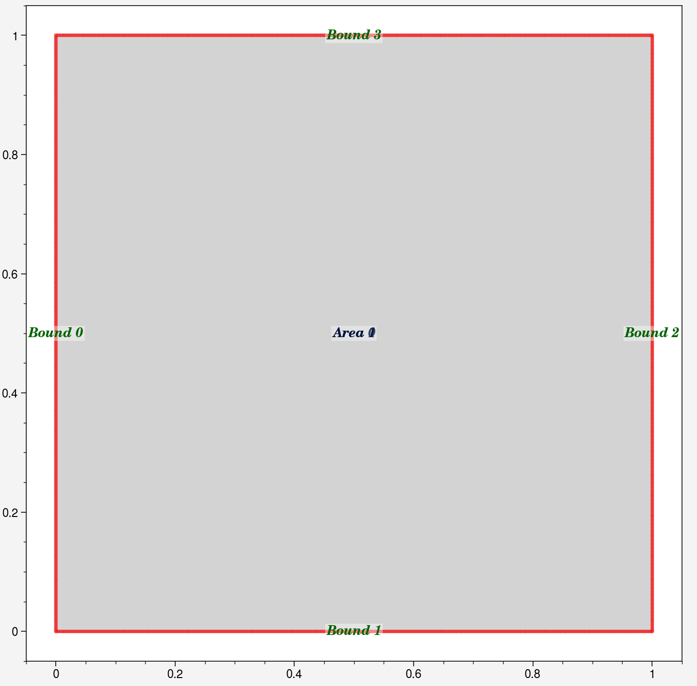
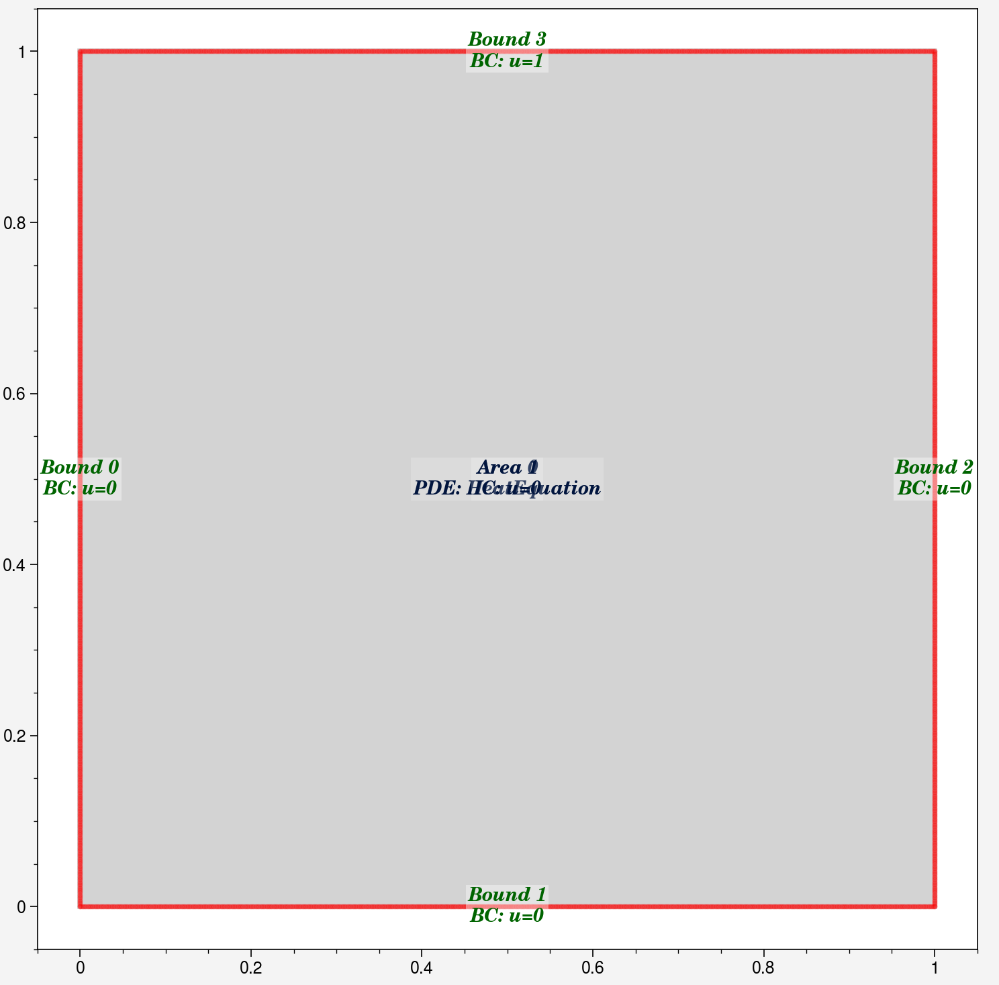
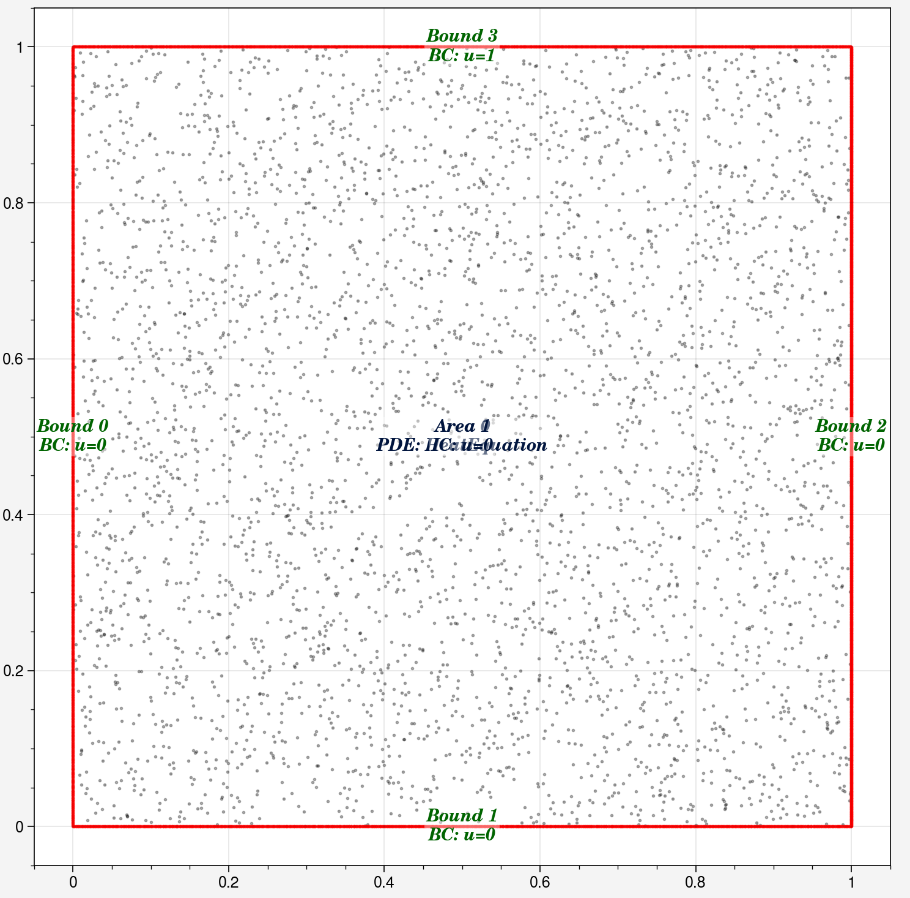
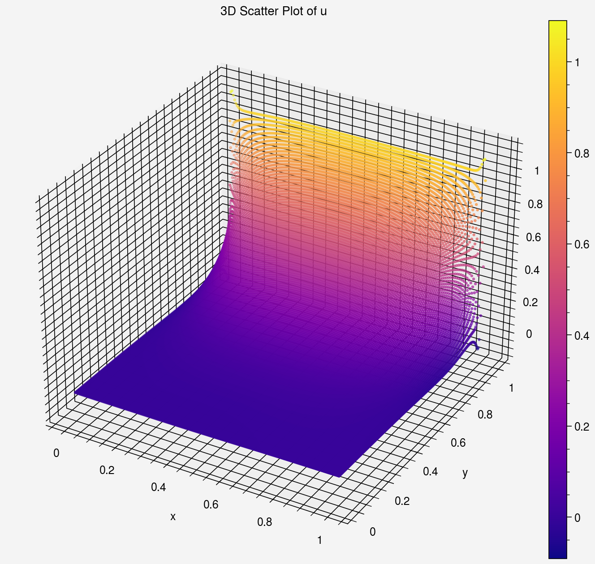
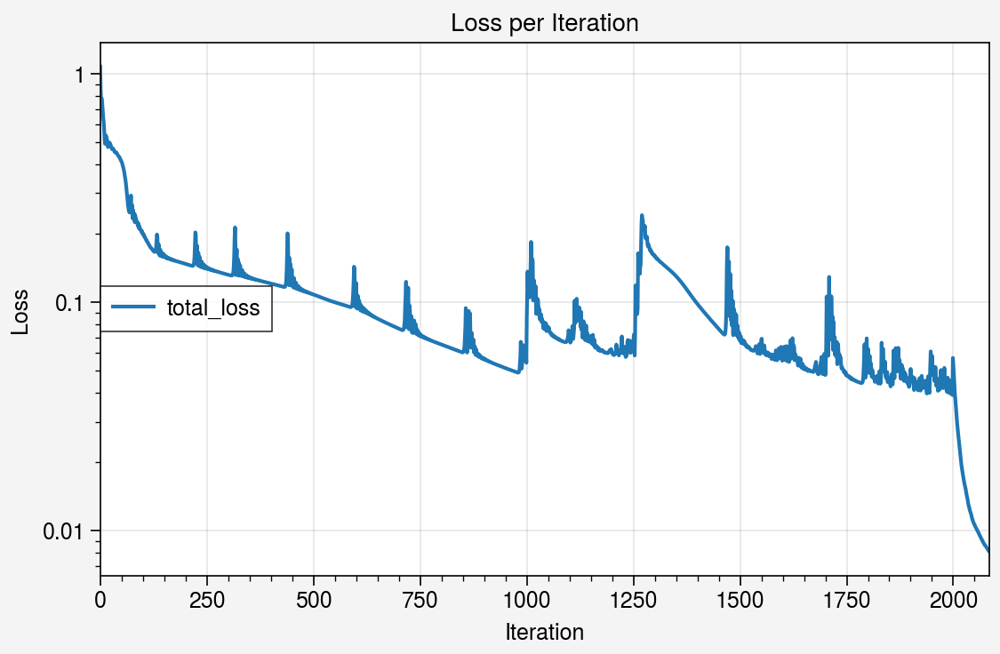

# Solving the 2D Unsteady Heat Equation

This example solves the transient 2D Fourier heat equation on a square with a
hot top boundary. It introduces DeepFlow's time handling: geometries are given
a time range, and the network takes `t` as an input variable.

!!! note "At a glance"
    - **Physics**: `u_t = α (u_xx + u_yy)` with `α = 0.1` on `[0, 1]²`,
      `t ∈ [0, 1]`. Boundary conditions: `u = 0` on the left, bottom, and
      right walls, `u = 1` on the top wall. Initial condition: `u = 0`.
    - **What to expect**: heat diffuses downward from the hot top wall; the
      solution is symmetric about `x = 0.5`. The animation shows the
      temperature field evolving from the initial state to steady diffusion.
    - **Setup cost**: FNN 32 × 4 (inputs `x, y, t`); Adam 2,000 epochs
      (lr 0.004) followed by L-BFGS 450 epochs (threshold 5e-3). Reference
      run: a few minutes on GPU.
    - **Verified against**: DeepFlow v0.1.3 (commit `828f392`).

## 1. Define the geometry

Two overlapping rectangles make up the domain: the first carries the PDE and
boundary conditions, the second carries the initial condition:

```python
import deepflow as df

df.manual_seed(69)  # for reproducibility

rectangle = df.geometry.rectangle([0, 1], [0, 1])
rectangle1 = df.geometry.rectangle([0, 1], [0, 1])
domain = df.domain(rectangle, rectangle1.area_list)
domain.show_setup()
```



## 2. Define the physics

```python
domain.bound_list[0].define_bc({'u': 0})  # Left wall
domain.bound_list[1].define_bc({'u': 0})  # Bottom wall
domain.bound_list[2].define_bc({'u': 0})  # Right wall
domain.bound_list[3].define_bc({'u': 1})  # Top wall: hot

domain.area_list[0].define_pde(df.pde.HeatEquation(0.1))
domain.area_list[1].define_ic({'u': 0})

for g in domain:
    g.define_time(range_t=[0, 1], sampling_scheme='random')

domain.show_setup()
```



!!! note
    `define_time` without an explicit `expo_scaling` argument emits the
    warning `expo_scaling has not yet defined. False is set as default.` —
    that is expected behavior; pass `expo_scaling=False` to silence it (see
    the [FAQ](faq.md)).

## 3. Sample training data

```python
domain.sampling_lhs([1000, 1000, 2000, 1000], [2000, 2000])
domain.show_coordinates(display_physics=True)
```



## 4. Train the model

R3 resampling is applied every 1,000 Adam epochs. The notebook also checks
that resampling does not empty any region of the time interval:

```python
import torch

def check_time_coverage():
    for geometry in domain.bound_list + domain.area_list:
        if geometry.physics_type == 'IC' or not isinstance(geometry.range_t, (tuple, list)):
            continue
        times = geometry.t
        start, end = map(float, geometry.range_t)
        edges = torch.linspace(start, end, 9, dtype=times.dtype, device=times.device)
        covered_bins = torch.unique(torch.bucketize(times.detach(), edges[1:-1])).numel()
        if covered_bins < 8:
            raise RuntimeError(f'Insufficient time coverage after R3: {covered_bins}/8 bins')
    print('R3 time coverage: all non-initial geometries span the full time interval')

def do_in_adam(epoch, model):
    if epoch % 1000 == 0 and epoch > 0:
        domain.sampling_R3([1000, 1000, 2000, 1000], [2000, 2000])
        check_time_coverage()
        print(domain)

check_time_coverage()

model0 = df.PINN(width=32, length=4, input_vars=['x', 'y', 't'], output_vars=['u'])
model1, model1_best = model0.train_adam(
    calc_loss=df.calc_loss_simple(domain),
    learning_rate=0.004,
    do_between_epochs=do_in_adam,
    epochs=2000)

model2, model2_best = model1_best.train_lbfgs(
    calc_loss=df.calc_loss_simple(domain),
    epochs=450,
    threshold_loss=5e-3)
```

!!! note "Reference-run result"
    Adam (2,000 epochs) + L-BFGS (450 epochs) reached `total_loss ≈ 1e-2`
    (threshold 5e-3) before the run was interrupted; the IC and BC residuals
    are the dominant terms. Longer L-BFGS runs converge further — the
    threshold and epoch count are the knobs to turn first.

## 5. Visualize the solution

Evaluate at a fixed time `t = 0.5` and plot the temperature field and the
loss history:

```python
prediction = domain.area_list[0].evaluate(model2)
prediction.sampling_area([200, 200])
prediction.define_time(0.5)

_ = prediction.plot('u', color='plasma')
_.savefig('heat_eq_u.png', dpi=200)
_ = prediction.plot_loss_curve(log_scale=True, keys=['total_loss'])
```




Animate the solution over time:

```python
prediction.sampling_area([160, 160])
prediction.plot_animate(
    'u',
    range_t=[0.02, 1.02],
    dt=0.02,
    frame_interval=100,
    cmap='plasma',
    plot_type='scatter',
    s=1.7,
).save('heat_equation.mp4', dpi=200)
```

<video controls src="static/examples/heat/heat_equation.mp4" width="100%"></video>

## 6. Optional: FEM reference comparison

With the `[cfd]` extra installed, the transient problem can also be solved by
the NGSolve backend:

```python
try:
    import ngsolve  # noqa: F401
except (ImportError, OSError) as exc:
    print(f'Skipping optional FEM comparison: {exc}')
else:
    import numpy as np

    time_interval = [0, 1]
    domain.area_list[0].define_time(time_interval, sampling_scheme='random')
    fem_reference = domain.solve_fem(
        mesh_size=0.1,
        boundary_resolution=32,
        time_step=0.1,
        max_iterations=1,
    )
    fem_area = fem_reference.area_list[0]
    query_time = float(time_interval[1])
    fem_area.sampling_area([80, 80])
    fem_area.define_time(query_time)
    fem_values = fem_area['u_ref']
    pinn_area = domain.area_list[0].evaluate(model2_best)
    u_error = float(np.mean(np.abs(pinn_area.data_dict['u'] - fem_values)))
    if not np.isfinite(u_error):
        raise RuntimeError('FEM comparison produced a non-finite error')
    print(f'FEM mean absolute u error at t={query_time:g}: {u_error:.6e}')
```

## Run it yourself

Source notebook:
[`examples/heat_eq/heat_eq.ipynb`](https://github.com/YoYo-XYZ/pinn-deepflow/blob/dev/examples/heat_eq/heat_eq.ipynb)

```bash
jupyter notebook examples/heat_eq/heat_eq.ipynb
```

This page is hand-authored; the notebook is the source of truth (see
[REGENERATE.md](https://github.com/YoYo-XYZ/pinn-deepflow/blob/dev/REGENERATE.md)).
