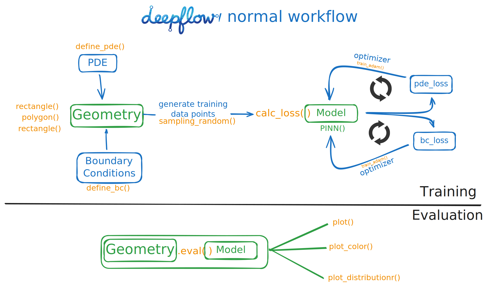

# DeepFlow: Physics-Informed Neural Networks for Fluid Dynamics

[](https://badge.fury.io/py/deepflow)

[](https://opensource.org/licenses/MIT)
[](https://www.python.org/downloads/)


DeepFlow is a user-friendly framework for solving partial differential equations (PDEs), such as the Navier-Stokes equations, using **Physics-Informed Neural Networks (PINNs)**. It provides a CFD-solver-style workflow to make PINN-based simulations accessible and straightforward.

## Key Features


- ⟁ **Physics-Attached Geometry**: **AUTO GENERATE TRAINING DATA** by explicitly attach physics and neural network to geometries.
- 🔧 **CFD-Solver Style**: Straightforward workflow similar to CFD software.
- 📊 **Built-in Visualization**: Tools to evaluate and plot results.
- 🚀 **GPU Acceleration**: Enable GPU for faster training.
- **Flexible Domain Definition**: Easily define complex 2D geometries.

## Current Implementations
- **Supported problems**: solving **forward** partial differential equations (PDEs)
    - transient & steady 2D imcompressible Navier-Stokes equations, 2D Fourier Heat equation, Burgers' equation
- **Sampling methods**: Uniform, Random, Latin Hypercube Sampling, RAR-G [[0]](https://arxiv.org/abs/2207.10289), R3 [[1]](https://arxiv.org/abs/2207.02338)
- **2D Geometries**: Custom functions, Rectangle, Circle, Polygon, and combinations & subtractions.
- **Hard Boundary Conditions**: Automatic Hard BC w.r.t. to geometry.
- **Neural Network Architectures**: Fully connected feedforward networks (FNN).
- **Optimizers**: Adam, L-BFGS
- **Backend**: PyTorch

## Installation

You can install DeepFlow via pip:

```bash
pip install deepflow
```

For development or to build from source:

```bash
git clone https://github.com/YoYo-XYZ/deepflow.git
cd deepflow
pip install -e .
```

## Requirements

- Python >= 3.8
- PyTorch >= 1.7.0
- NumPy >= 1.19.0
- Matplotlib >= 3.3.0
- SymPy >= 1.5.0
- SciPy >= 1.5.0
- Ultrplot >= 1.0.0

## Quick Start


Check out the [Quick Start](quickstart.md) guide to simulate Steady channel flow **under 20 lines of code!**

## Examples

See [Examples](examples.md) for more use cases including Burgers' Equation, Heat Equation, and Cavity Flow.

## DeepFlow Milestones

...

