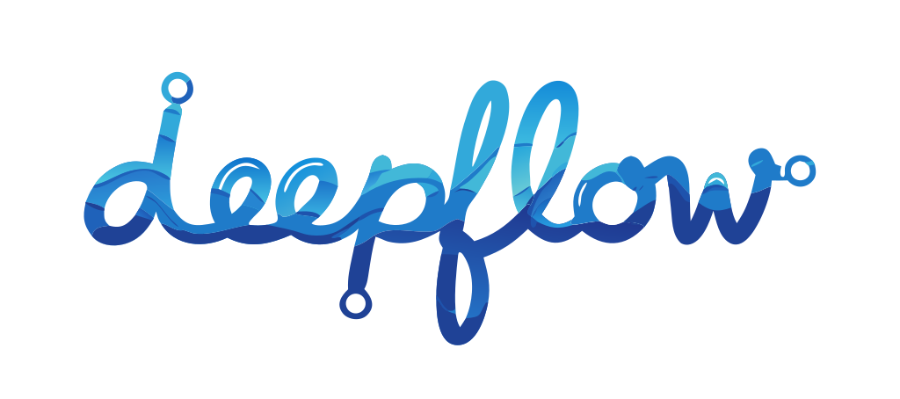
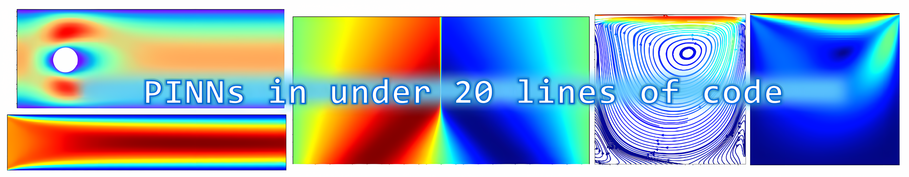

# DeepFlow: Physics-informed neural networks for fluid dynamics

DeepFlow is a user-friendly framework for solving PDEs, with a focus on fluid
dynamics including the Navier–Stokes equations, using **Physics-Informed
Neural Networks (PINNs)**. It provides a CFD-solver-style workflow that makes
PINN-based simulations accessible and straightforward.

## Getting started

- [**Installation**](getting-started/install.md) — pip, the `[cfd]` extra, and GPU setup
- [**Quick start**](getting-started/quickstart.md) — solve steady channel flow in under 20 lines of code
- [**Model persistence**](guides/persistence.md) — save and load trained models
- [**FAQ**](guides/faq.md) — training, sampling, and troubleshooting
- [**Examples**](examples/index.md) — a gallery of 6 worked cases, from Burgers' equation to transient channel flow
- [**API reference**](reference/index.md) — full documentation of the `deepflow` package
- [**Contributing**](project/contributing.md) — development setup and contribution workflow
- [**Changelog**](project/changelog.md) — release history
- [**Citing DeepFlow**](project/cite.md) — citation details and background reading
- [**GitHub repository**](https://github.com/YoYo-XYZ/pinn-deepflow) — source, long-form README, and issue tracker

## Key features

- ⟁ **Physics-Attached Geometry**: **AUTO GENERATE TRAINING DATA** by explicitly attach physics and neural network to geometries.
- 🔧 **CFD-Solver Style**: Straightforward workflow similar to CFD software.
- 📊 **Built-in Visualization**: Tools to evaluate and plot results.
- 🚀 **GPU Acceleration**: Enable GPU for faster training.
- 🔢 **FP64 Precision**: Switch to double precision for improved PINN accuracy/stability.
- **Flexible Domain Definition**: Easily define complex 2D geometries.

## Current implementations

- **Supported problems**: solving **forward** partial differential equations (PDEs)
    - transient & steady 2D incompressible Navier-Stokes equations, 2D Fourier Heat equation, Burgers' equation
- **Sampling methods**: Uniform, Random, Latin Hypercube Sampling, RAR-G [[0]](https://arxiv.org/abs/2207.10289), R3 [[1]](https://arxiv.org/abs/2207.02338)
- **2D Geometries**: Custom functions, Rectangle, Circle, Polygon, and combinations & subtractions.
- **Hard Boundary Conditions**: Automatic Hard BC w.r.t. to geometry.
- **Neural Network Architectures**: Fully connected feedforward networks (FNN).
- **Optimizers**: Adam, L-BFGS
- **Backend**: PyTorch, with an optional NGSolve FEM reference backend (`pip install "deepflow[cfd]"`)

## License

This project is licensed under the MIT License - see the [LICENSE](https://github.com/YoYo-XYZ/pinn-deepflow/blob/dev/LICENSE) file for details.
