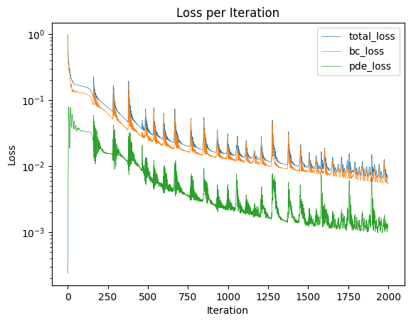

# Quick Start

This example demonstrates how to simulate Steady channel flow **under 20 lines of code!** We recommend using a Python notebook (`.ipynb`) for interactive experience.

## 1. Define the Geometry and Physics

```python
import deepflow as df

# Define the area and bounds
rectangle = df.geometry.rectangle([0, 5], [0, 1])
domain = df.domain(rectangle)

domain.show_setup() # Display the domain setup
```

```python
# Define Boundary Conditions
domain.bound_list[0].define_bc({'u': 1, 'v': 0})  # Inflow: u=1
domain.bound_list[1].define_bc({'u': 0, 'v': 0})  # Wall: No slip
domain.bound_list[2].define_bc({'p': 0})          # Outflow: p=0
domain.bound_list[3].define_bc({'u': 0, 'v': 0})  # Wall: No slip

# Define PDE (Navier-Stokes)
domain.area_list[0].define_pde(df.pde.NavierStokes(U=0.0001, L=1, mu=0.001, rho=1000))

domain.show_setup() # Display the domain setup
```


```python
# Sample points: [Left, Bottom, Right, Top], [Interior]
domain.sampling_random([200, 400, 200, 400], [5000])
domain.show_coordinates(display_physics=True)
```

# 2. Create and Train the model


```python
# Initialize the PINN model
model0 = df.PINN(width=40, length=4)
```
```python
# Train the model using Adam Optimizer
model1 = model0.train_adam(
    calc_loss=df.calc_loss_simple(domain),
    learning_rate=0.001,
    epochs=2000,)
```

# 3. Visualize Results
```python
# Evaluate the best model
prediction = domain.area_list[0].evaluate(model1_best)
prediction.sampling_area([500, 100])

# Plot Velocity Field
_ = prediction.plot_color('u', cmap='jet')

# Plot Training Loss
_ =prediction.plot_loss_curve()
```


