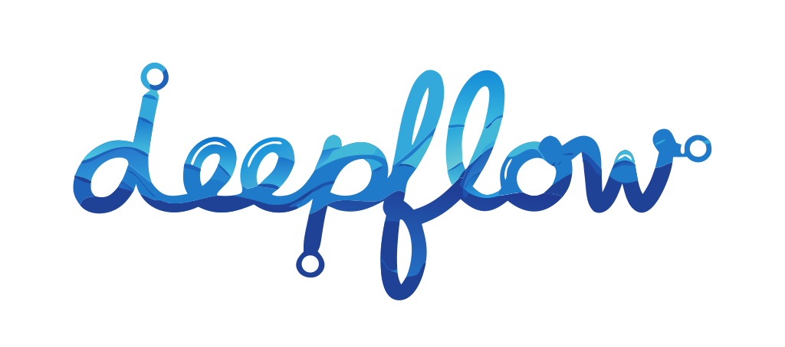
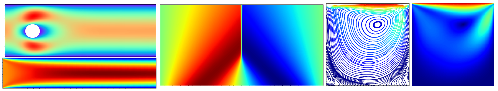
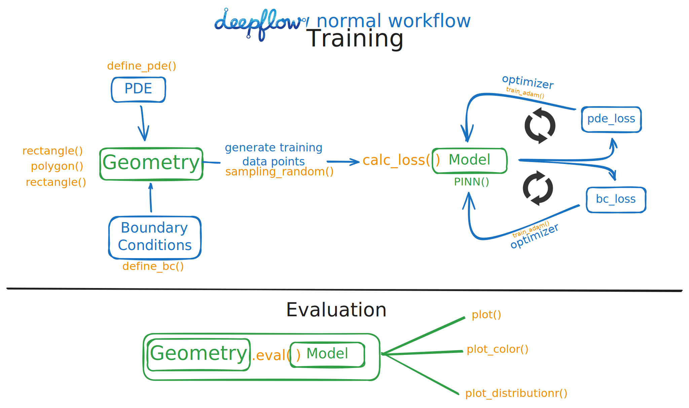
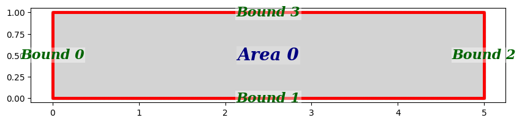
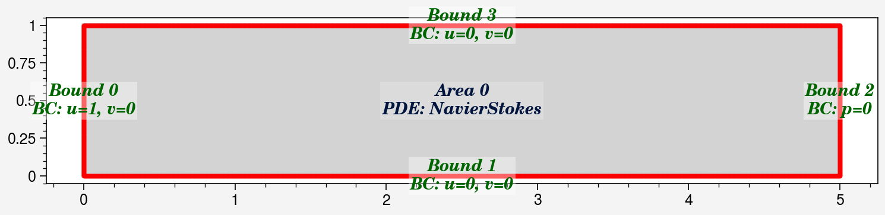
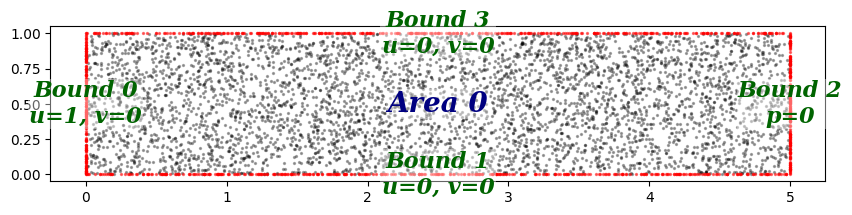
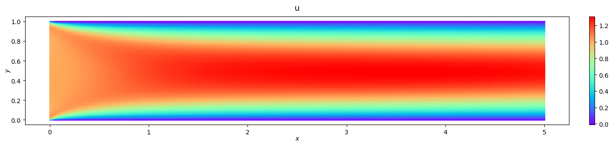

# DeepFlow: Physics-Informed Neural Networks for Fluid Dynamics

[](https://badge.fury.io/py/deepflow)
[](https://opensource.org/licenses/MIT)
[](https://www.python.org/downloads/)



DeepFlow is a user-friendly framework for solving partial differential equations (PDEs), such as the Navier-Stokes equations, using **Physics-Informed Neural Networks (PINNs)**. It provides a CFD-solver-style workflow to make PINN-based simulations accessible and straightforward.

## Table of Contents

- [**Key Features**](#features)
- [Current Implementations](#current-implementations)
- [**Installation**](#installation)
- [Requirements](#requirements)
- [**Quick Start**](#quick-start)
- [Examples](#examples)
- [Contributing](#contributing)
- [License](#license)
- [**DeepFlow Milestones**](#future-milestones)

## Key Features



- ⟁ **Physics-Attached Geometry**: **AUTO GENERATE TRAINING DATA** by explicitly attach physics and neural network to geometries.
- 🔧 **CFD-Solver Style**: Straightforward workflow similar to CFD software.
- 📊 **Built-in Visualization**: Tools to evaluate and plot results.
- 🚀 **GPU Acceleration**: Enable GPU for faster training.
- **Flexible Domain Definition**: Easily define complex 2D geometries.

## Current Implementations
- **Supported problems**: solving **forward** partial differential equations (PDEs)
    - transient & steady 2D imcompressible Navier-Stokes equations, 2D Fourier Heat equation, Burgers' equation
- **Sampling methods**: Uniform, Random, Latin Hypercube Sampling, RAR-G [[0]](https://arxiv.org/abs/2207.10289), R3 [[1]](https://arxiv.org/abs/2207.02338)
- **2D Geometries**: Custom functions, Rectangle, Circle, Polygon, and combinations & subtractions.
- **Hard Boundary Conditions**: Automatic Hard BC w.r.t. to geometry.
- **Neural Network Architectures**: Fully connected feedforward networks (FNN).
- **Optimizers**: Adam, L-BFGS
- **Backend**: PyTorch

## Installation

You can install DeepFlow via pip:

```bash
pip install deepflow
```

For development or to build from source:

```bash
git clone https://github.com/YoYo-XYZ/deepflow.git
cd deepflow
pip install -e .
```

## Requirements

- Python >= 3.8
- PyTorch >= 1.7.0
- NumPy >= 1.19.0
- Matplotlib >= 3.3.0
- SymPy >= 1.5.0
- SciPy >= 1.5.0
- Ultrplot >= 1.0.0

## Quick Start

This example demonstrates how to simulate Steady channel flow **under 20 lines of code!** We recommend using a Python notebook (`.ipynb`) for interactive experience.

### 1. Define the Geometry and Physics

```python
import deepflow as df

# Define the area and bounds
rectangle = df.geometry.rectangle([0, 5], [0, 1])
domain = df.domain(rectangle)

domain.show_setup() # Display the domain setup
```

```python
# Define Boundary Conditions
domain.bound_list[0].define_bc({'u': 1, 'v': 0})  # Inflow: u=1
domain.bound_list[1].define_bc({'u': 0, 'v': 0})  # Wall: No slip
domain.bound_list[2].define_bc({'p': 0})          # Outflow: p=0
domain.bound_list[3].define_bc({'u': 0, 'v': 0})  # Wall: No slip

# Define PDE (Navier-Stokes)
domain.area_list[0].define_pde(df.pde.NavierStokes(U=0.0001, L=1, mu=0.001, rho=1000))

domain.show_setup() # Display the domain setup
```


```python
# Sample points: [Left, Bottom, Right, Top], [Interior]
domain.sampling_random([200, 400, 200, 400], [5000])
domain.show_coordinates(display_physics=True)
```

### 2. Create and Train the model


```python
# Initialize the PINN model
model0 = df.PINN(width=40, length=4)
```
```python
# Train the model using Adam Optimizer
model1 = model0.train_adam(
    calc_loss=df.calc_loss_simple(domain),
    learning_rate=0.001,
    epochs=2000,)
```

### 3. Visualize Results
```python
# Evaluate the best model
prediction = domain.area_list[0].evaluate(model1_best)
prediction.sampling_area([500, 100])

# Plot Velocity Field
_ = prediction.plot_color({'u': 'rainbow'})

# Plot Training Loss
_ =prediction.plot_loss_curve(log_scale=True)
```



## Examples

Explore the [examples](examples)
 directory for real use cases, including:

- [Steady flow around a cylinder](examples/cylinder_flow_steady)
- [Lid-driven cavity flow](examples/cavity_flow_steady)
- [Burgers' Equation](examples/burgers_eq)
- [Time-dependent Fourier Heat Equation](examples/heat_eq)

Each example includes Jupyter notebooks and data files.

## Contributing

Feel free to submit a Pull Request. For major changes, open an issue first to discuss the proposed changes.

## DeepFlow Milestones

1. Define custom PDE
2. Inverse problems PDE
3. 3D Geometries
4. More sampling methods
5. More neural network architectures (e.g., CNN, RNN)

## License

This project is licensed under the MIT License - see the [LICENSE](LICENSE) file for details.
