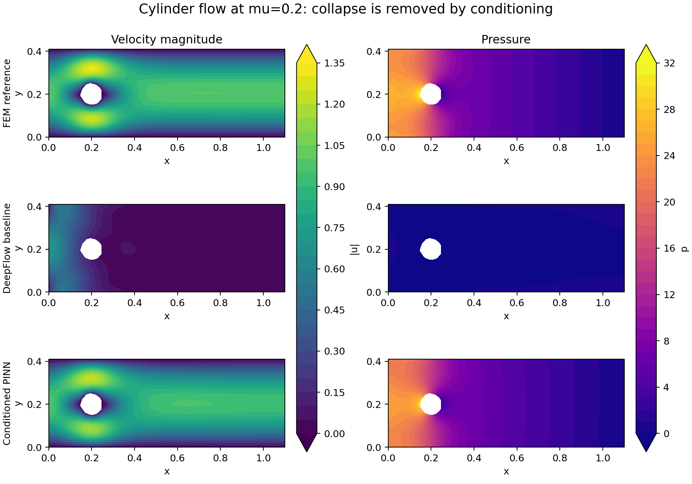

# DeepFlow low-Re cylinder-flow investigation

## Conclusion

The observed reversal is real, but it is an optimization/formulation pathology rather than a physical increase in solution complexity at low Reynolds number. With fixed inlet velocity, the low-Re velocity field is smoother and changes little as viscosity rises; the pressure level and viscous-pressure cancellation grow approximately in proportion to viscosity. DeepFlow leaves pressure, the momentum residuals, and the network coordinates poorly conditioned for that regime. The optimizer can lower the PDE loss much more easily by suppressing velocity curvature and accepting inlet-boundary error, producing a near-stagnant field.

## Direct evidence

Fresh NGSolve FEM references used the same geometry and boundary setup, a 0.025 mesh size, and converged nonlinear solves.

| Case | FEM max pressure | FEM max velocity |
|---|---:|---:|
| `mu=0.02` | 3.650 | 1.299 |
| `mu=0.2` | 31.186 | 1.309 |

Pressure grows by 8.54x while velocity barely changes. For the unobstructed parabolic channel, the analytic pressure drop is `8*mu*Umax*Lx/H^2`, or 1.047 and 10.470, before the cylinder's additional resistance.

The shipped `mu=0.02` model has 1.66% relative L2 `u` error and 1.65% speed error against the fresh FEM reference. Reusing exactly those velocity weights at `mu=0.2` still gives only 5.96% `u` and 6.15% speed error. Multiplying only its pressure output by 10 changes low-Re pressure error from 89.97% to 6.73%. Thus the network already represents a near-correct low-Re field; training is what drives it away.

The zero-output network is an exact zero-residual PDE solution and satisfies every boundary except the inlet. Its continuous inlet MSE is

`integral_0^1 [4 t (1-t)]^2 dt = 8/15 = 0.5333`,

independent of viscosity. This creates an easy low-curvature basin. Increasing `mu` makes errors in velocity Laplacians cost quadratically more and requires a much larger pressure gradient to cancel them, making that basin more attractive to gradient-based training.

## Controlled training results

All rows used seed 69, 300 LHS points on each boundary, 3,000 interior LHS points, a 5x32 tanh PINN, and fresh FEM validation. Baseline used Adam(600)+L-BFGS(60); other listed ablations used Adam(600)+L-BFGS(50), so the successful run did not receive more training.

| `mu=0.2` setup | Relative L2 speed | Relative L2 pressure |
|---|---:|---:|
| DeepFlow baseline | 90.60% | 105.21% |
| Exact `p=0` outlet transform only | 90.32% | 105.35% |
| Naive `p x 10`, momentum residual `x 0.1` | 91.39% | 104.49% |
| Scaling core: pressure `x 30`, residual `x 1/30`, exact outlet pressure | 21.90% | 25.21% |
| Full conditioning: scaling core + normalized coordinates + BC warm-up + outlet gradients | **5.52%** | **6.87%** |

The naive scale fails because it also multiplies the randomly initialized outlet-pressure error, causing Adam to erase pressure globally. Enforcing the homogeneous pressure outlet structurally avoids that initial conflict. The full conditioned setup also used `x,y` mapped to `[-1,1]`, Adam boundary weight 10 followed by equal-weight L-BFGS, and `u_x=v_x=0` at the outlet to match the natural zero-viscous-flux condition in the FEM reference.

## Repository causes

1. `NavierStokes` constructs `scale_map` and exposes `nondimensionalize_inputs`, but no training path calls it. `PhysicsAttach.process_pde` sends raw coordinates and outputs directly into the residual. Therefore `U`, `L`, and the advertised pressure scale do not actually scale the network inputs/outputs; `U` and `L` only alter `Re`.

2. The strong residual is `convective + pressure gradient - Laplacian/Re`. At fixed velocity and lower Re, pressure must grow as `1/Re`, but the raw network gives all three outputs the same initialization and parameterization scale.

3. The loss is an unweighted sum of per-geometry MSEs. There is no equation normalization, gradient balancing, or protection against the PDE-versus-inlet conflict.

4. The example resamples during L-BFGS every 100 outer epochs while retaining the optimizer's curvature history. L-BFGS assumes one fixed deterministic objective; changing all collocation points invalidates that history. Keep collocation points fixed during L-BFGS or recreate the optimizer after resampling.

5. The notebook computes `model2best` but saves `model2`. The shipped model has a recorded minimum loss of 0.00141 but a final recorded loss of 0.01195. Save the best model.

6. The example is not a reproduction of the cited Rao et al. method. The paper's code uses a mixed streamfunction-pressure-stress formulation, an 8x40 network, 50,000 PDE points including 10,000 refined near the cylinder, boundary weight 2, Adam for 10,000 steps at `5e-4`, then L-BFGS-B up to 100,000 iterations. DeepFlow uses direct `(u,v,p)`, 5x32, 4,000 unrefined interior points, 2,000 Adam steps at `4e-3`, and 450 L-BFGS outer steps.

7. The reported DeepFlow Reynolds number uses `L=1`. The cylinder diameter is 0.1, so the body-based Reynolds numbers are 5 at `mu=0.02` and 0.5 at `mu=0.2`, not 50 and 5. This does not cause the bug, but it obscures the physical regime.

## Recommended fixes

In priority order:

1. Implement real nondimensionalization in the model/PDE path. Scale coordinates and outputs before evaluating the dimensionless equations, and use a regime-appropriate pressure scale. For viscous-dominated internal flow, a scale based on the expected viscous pressure drop is more useful than only `rho*U^2`.

2. Normalize each momentum residual by its characteristic magnitude. This preserves the PDE zero set while preventing viscosity from changing the optimization problem by orders of magnitude. Add adaptive gradient-based loss balancing for continuity, both momentum equations, and each boundary group.

3. Enforce homogeneous conditions such as outlet pressure with an output transform where practical. If the FEM reference is the target problem, also impose the corresponding outlet natural condition explicitly in the strong PINN (or use a variational/mixed formulation).

4. Prefer the mixed stress formulation from the cited paper for this benchmark. It is explicitly designed to improve trainability by replacing the direct second-velocity-derivative momentum form with a first-order mixed system and analytically divergence-free velocity.

5. Normalize `x,y` to moderate, comparable ranges; use more interior points and refine around the cylinder. Keep L-BFGS samples fixed and save `model2best`.

6. Treat FP64 as a useful secondary experiment for late L-BFGS convergence, not the primary repair: the FP32 conditioned run already removed the failure.

## Literature alignment

- Rao, Sun & Liu's original low-Re cylinder paper proposes a mixed-variable stress formulation specifically because the traditional high-derivative residual is difficult to train, and reports the sampling/training setup described above: <https://arxiv.org/abs/2002.10558>.
- Wang et al.'s expert guide makes nondimensionalization the first stage of its PINN pipeline and states that inputs and outputs should be order one, followed by residual/loss re-scaling: <https://arxiv.org/abs/2308.08468>.
- Wang, Teng & Perdikaris identify unbalanced back-propagated gradients caused by numerical stiffness in composite PINN losses: <https://arxiv.org/abs/2001.04536>.
- Rohrhofer et al. show that physical coefficients and characteristic scales effectively rescale PINN objectives and shift which points are reachable by gradient training: <https://arxiv.org/abs/2105.00862>.
- Xiang et al. demonstrate adaptive loss balancing specifically for incompressible Navier-Stokes PINNs: <https://arxiv.org/abs/2104.06217>.

## Artifacts

- `experiment.py`: controlled trainer and FEM evaluator
- `evaluate_transfer.py`: viscosity/pressure transfer test
- `metrics_*.json`: complete metrics
- `fem_mu_*.npz`: FEM fields
- `fields_*.npz`: PINN fields
- `low_re_comparison.png`: visual comparison
- `upstream_paper_code/`: shallow clone of the cited authors' public implementation
